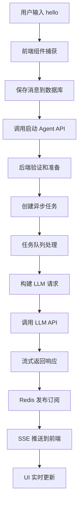

# "Hello" 消息完整执行流程分析

当用户在 Suna 界面输入 "hello" 并发送时，系统的完整执行流程如下：

## 🔄 执行流程概览



## 📱 第一步：前端输入处理

### 1.1 用户输入组件
**文件**: `frontend/src/components/thread/chat-input/message-input.tsx`

```typescript
// 用户输入 "hello" 后按下 Enter
const handleKeyDown = (e: React.KeyboardEvent) => {
  if (e.key === 'Enter' && !e.shiftKey) {
    e.preventDefault();
    onSubmit();  // 触发提交
  }
};
```

### 1.2 消息提交处理
**文件**: `frontend/src/components/thread/chat-input/chat-input.tsx`

```typescript
const handleSubmit = async () => {
  const content = value.trim();  // "hello"
  
  // 1. 创建用户消息对象
  const userMessage = {
    thread_id: threadId,
    content: content,
    role: 'user',
    created_at: new Date().toISOString()
  };
  
  // 2. 保存到数据库
  await supabase
    .from('messages')
    .insert(userMessage);
  
  // 3. 启动 Agent
  await startAgent();
};
```

## 🔌 第二步：API 调用

### 2.1 启动 Agent 请求
**文件**: `frontend/src/hooks/react-query/threads/use-agent-run.ts`

```typescript
const startAgent = async () => {
  const response = await fetch(
    `/api/thread/${threadId}/agent/start`,
    {
      method: 'POST',
      headers: {
        'Authorization': `Bearer ${token}`,
        'Content-Type': 'application/json'
      },
      body: JSON.stringify({
        agent_id: selectedAgentId,
        stream: true
      })
    }
  );
};
```

## ⚙️ 第三步：后端处理

### 3.1 API 端点接收
**文件**: `backend/agent/api.py`

```python
@router.post("/thread/{thread_id}/agent/start")
async def start_agent(
    thread_id: str,
    request: StartAgentRequest,
    user_id: str = Depends(get_current_user_id)
):
    # 1. 验证用户权限
    thread = await verify_thread_access(thread_id, user_id)
    
    # 2. 加载 Agent 配置
    agent = await get_agent_config(request.agent_id)
    
    # 3. 检查计费状态
    await check_billing_status(user_id)
    
    # 4. 创建 agent_run 记录
    agent_run = await create_agent_run(
        thread_id=thread_id,
        agent_id=request.agent_id,
        user_id=user_id
    )
    
    # 5. 创建异步任务
    task = run_agent_task.send(
        thread_id=thread_id,
        agent_run_id=agent_run.id,
        stream=request.stream
    )
    
    return {"agent_run_id": agent_run.id}
```

### 3.2 异步任务处理
**文件**: `backend/run_agent_background.py`

```python
@dramatiq.actor
def run_agent_task(thread_id: str, agent_run_id: str, stream: bool):
    # 1. 初始化 Redis 连接
    redis_client = get_redis_client()
    
    # 2. 设置流式响应通道
    stream_key = f"stream:{agent_run_id}"
    
    # 3. 执行 Agent 逻辑
    for chunk in run_agent(thread_id, agent_run_id):
        if stream:
            # 发布到 Redis
            redis_client.publish(stream_key, json.dumps(chunk))
        
        # 存储完整响应
        redis_client.append(f"response:{agent_run_id}", chunk['content'])
```

## 🤖 第四步：Agent 执行逻辑

### 4.1 Agent 运行核心
**文件**: `backend/agent/run.py`

```python
def run_agent(thread_id: str, agent_run_id: str):
    # 1. 加载对话历史
    messages = load_thread_messages(thread_id)
    # messages 包含用户的 "hello" 消息
    
    # 2. 初始化 ThreadManager
    thread_manager = ThreadManager(
        thread_id=thread_id,
        messages=messages
    )
    
    # 3. 注册工具
    register_tools(thread_manager)
    
    # 4. 构建系统提示词
    system_prompt = build_system_prompt(agent_config)
    
    # 5. 调用 LLM
    while True:
        # 准备消息上下文
        prompt_messages = [
            {"role": "system", "content": system_prompt},
            *format_messages(thread_manager.messages)
        ]
        
        # 流式调用 LLM
        for chunk in litellm.completion(
            model=agent_config.model,
            messages=prompt_messages,
            stream=True
        ):
            content = chunk.choices[0].delta.content
            
            # 处理工具调用
            if is_tool_call(content):
                tool_result = execute_tool(content)
                thread_manager.add_tool_result(tool_result)
                continue
            
            # 返回助手回复
            yield {
                "type": "assistant_message",
                "content": content
            }
        
        break  # 简单回复不需要工具调用
```

### 4.2 LLM 调用
**文件**: `backend/services/llm.py`

```python
def completion(**kwargs):
    # LiteLLM 统一接口，支持多种模型
    # 对于 "hello"，模型可能返回：
    # "Hello! How can I assist you today?"
    
    return litellm.completion(
        **kwargs,
        api_key=get_api_key(kwargs['model'])
    )
```

## 📡 第五步：流式响应传输

### 5.1 SSE 端点
**文件**: `backend/api.py`

```python
@app.get("/agent-run/{agent_run_id}/stream")
async def stream_agent_response(
    agent_run_id: str,
    user_id: str = Depends(get_current_user_id)
):
    # 1. 验证权限
    await verify_agent_run_access(agent_run_id, user_id)
    
    # 2. 创建 SSE 流
    async def event_generator():
        redis_client = get_redis_client()
        pubsub = redis_client.pubsub()
        pubsub.subscribe(f"stream:{agent_run_id}")
        
        for message in pubsub.listen():
            if message['type'] == 'message':
                yield f"data: {message['data']}\n\n"
    
    return StreamingResponse(
        event_generator(),
        media_type="text/event-stream"
    )
```

## 🖥️ 第六步：前端接收和显示

### 6.1 流式数据接收
**文件**: `frontend/src/hooks/useAgentStream.ts`

```typescript
export function useAgentStream(agentRunId: string) {
  useEffect(() => {
    // 建立 SSE 连接
    const eventSource = new EventSource(
      `/api/agent-run/${agentRunId}/stream`
    );
    
    eventSource.onmessage = (event) => {
      const data = JSON.parse(event.data);
      
      if (data.type === 'assistant_message') {
        // 更新助手消息
        setAssistantMessage(prev => prev + data.content);
      }
    };
    
    return () => eventSource.close();
  }, [agentRunId]);
}
```

### 6.2 UI 实时更新
**文件**: `frontend/src/components/thread/content/ThreadContent.tsx`

```typescript
// 助手回复 "Hello! How can I assist you today?"
<div className="assistant-message">
  {assistantMessage}
  {isStreaming && <CursorBlink />}
</div>
```

## 🔍 关键技术点

### 1. **异步处理**
- 使用 Dramatiq + RabbitMQ 处理耗时的 LLM 调用
- 避免阻塞主线程，提高系统响应性

### 2. **流式传输**
- Server-Sent Events (SSE) 实现实时推送
- Redis Pub/Sub 作为消息中间件

### 3. **状态管理**
- Supabase 持久化消息历史
- Redis 缓存临时状态和流数据

### 4. **错误处理**
- 每层都有错误捕获和重试机制
- 用户友好的错误提示

### 5. **性能优化**
- 消息批处理
- 连接池复用
- 响应缓存

## 📊 性能指标

对于 "hello" 这样的简单消息：
- **用户输入到 API 调用**: ~50ms
- **API 处理和任务创建**: ~100ms
- **LLM 首个 token**: ~500ms (取决于模型)
- **完整响应时间**: ~1-2s

## 🎯 总结

整个流程体现了现代 AI 应用的最佳实践：
1. **解耦设计**: 前后端分离，通过 API 通信
2. **异步架构**: 使用消息队列处理耗时操作
3. **实时体验**: 流式响应提供即时反馈
4. **可扩展性**: 模块化设计便于添加新功能
5. **可靠性**: 多层错误处理和重试机制

这种架构确保了即使在高并发情况下，系统也能保持良好的响应性和用户体验。

## 相关文档

想要深入了解系统的各个方面？请查看：

- [聊天流程分析](../02-core-architecture/chat-flow-analysis.md) - 更详细的技术分析
- [架构总览](../02-core-architecture/architecture-overview.md) - 了解整体系统设计
- [ThreadManager 分析](../02-core-architecture/thread-manager-analysis.md) - 深入了解对话管理
- [异步任务架构](../02-core-architecture/async-task-architecture.md) - 了解异步处理机制
- [工具系统](../03-tool-system/tool-system-overview.md) - 了解工具如何工作