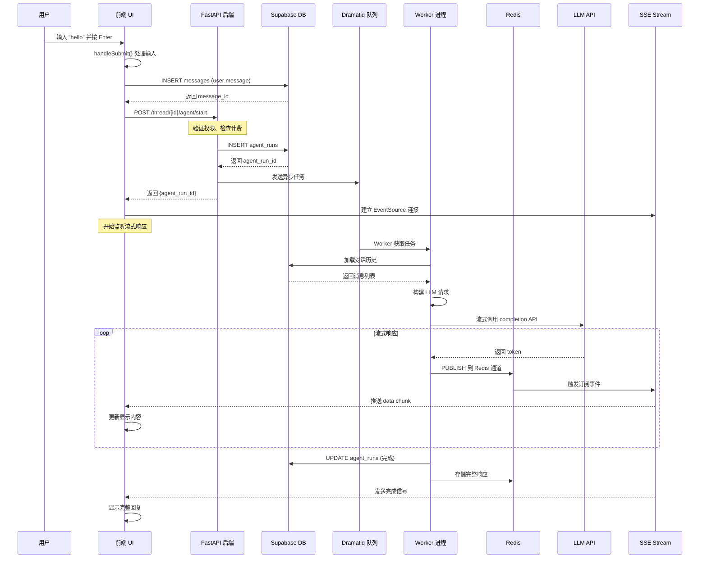
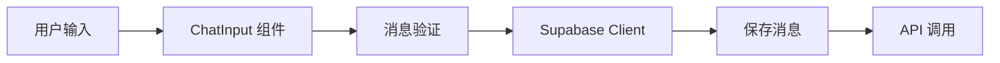
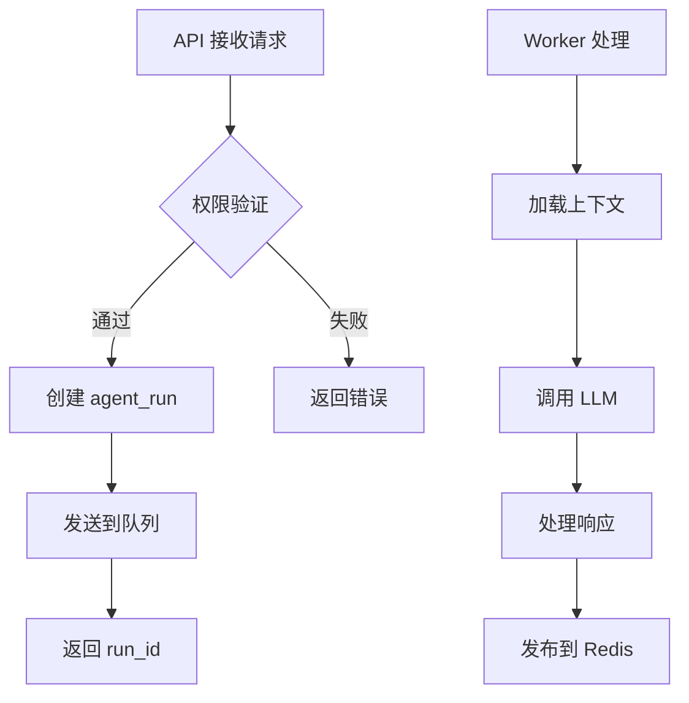
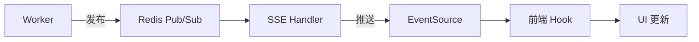

# Suna "Hello" 消息处理时序图

## 完整时序图



## 关键组件交互

### 1. 前端发起请求



### 2. 后端处理流程



### 3. 实时通信机制



## 数据流动

### 消息数据结构

```typescript
// 用户消息
{
  id: "msg_123",
  thread_id: "thread_456",
  role: "user",
  content: "hello",
  created_at: "2024-01-01T10:00:00Z"
}

// Agent 响应
{
  type: "assistant_message",
  content: "Hello! How can I assist you today?",
  agent_run_id: "run_789"
}
```

### Redis 键值设计

```
stream:{agent_run_id}    # Pub/Sub 通道
response:{agent_run_id}  # 完整响应存储
status:{agent_run_id}    # 运行状态
```

## 性能优化点

1. **并发处理**
   - 多个 Worker 并行处理任务
   - Redis 连接池复用

2. **缓存策略**
   - 对话历史缓存
   - LLM 响应缓存

3. **流式优化**
   - 按需建立 SSE 连接
   - 自动重连机制

4. **资源管理**
   - 连接超时控制
   - 内存使用限制