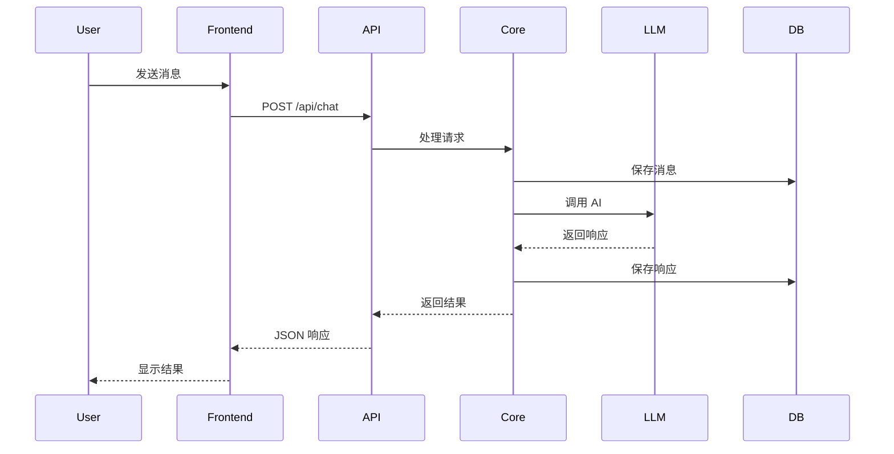
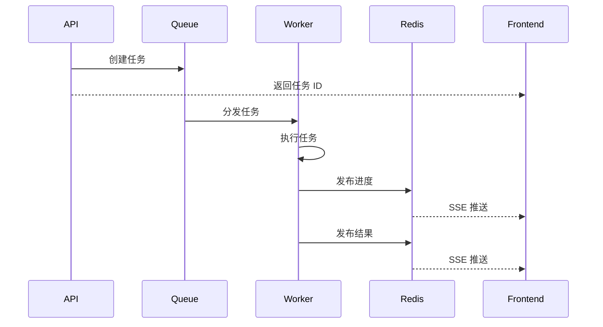

# Suna 架构总览

## 整体架构

Suna 采用现代化的分层架构设计，由前端应用、API 网关、核心服务、基础设施四个主要层次组成。

```
┌─────────────────────────────────────────────────────────────┐
│                     前端应用 (Next.js)                        │
│  ┌──────────┐  ┌──────────┐  ┌──────────┐  ┌──────────┐   │
│  │  Chat UI │  │ Workflow │  │  Agent   │  │ Settings │   │
│  │   组件   │  │  编辑器  │  │  管理器  │  │   配置   │   │
│  └──────────┘  └──────────┘  └──────────┘  └──────────┘   │
└─────────────────────────────────────────────────────────────┘
                              │
                              ▼
┌─────────────────────────────────────────────────────────────┐
│                   API 网关 (FastAPI)                         │
│  ┌──────────┐  ┌──────────┐  ┌──────────┐  ┌──────────┐   │
│  │   认证   │  │  路由    │  │  限流    │  │  日志    │   │
│  │  中间件  │  │  分发    │  │  控制    │  │  记录    │   │
│  └──────────┘  └──────────┘  └──────────┘  └──────────┘   │
└─────────────────────────────────────────────────────────────┘
                              │
                              ▼
┌─────────────────────────────────────────────────────────────┐
│                        核心服务层                             │
│  ┌─────────────────────────────────────────────────────┐   │
│  │              ThreadManager (对话管理)                 │   │
│  │  - 消息历史管理  - 上下文压缩  - 工具协调           │   │
│  └─────────────────────────────────────────────────────┘   │
│  ┌─────────────────────────────────────────────────────┐   │
│  │              ToolRegistry (工具注册)                  │   │
│  │  - 工具发现  - Schema 管理  - 执行调度              │   │
│  └─────────────────────────────────────────────────────┘   │
│  ┌─────────────────────────────────────────────────────┐   │
│  │            WorkflowEngine (工作流引擎)                │   │
│  │  - 流程编排  - 触发管理  - 执行监控                 │   │
│  └─────────────────────────────────────────────────────┘   │
│  ┌─────────────────────────────────────────────────────┐   │
│  │          ResponseProcessor (响应处理)                 │   │
│  │  - 流式解析  - 工具检测  - 结果格式化               │   │
│  └─────────────────────────────────────────────────────┘   │
└─────────────────────────────────────────────────────────────┘
                              │
                              ▼
┌─────────────────────────────────────────────────────────────┐
│                        基础设施层                             │
│  ┌──────────┐  ┌──────────┐  ┌──────────┐  ┌──────────┐   │
│  │ Dramatiq │  │  Redis   │  │ Supabase │  │  Docker  │   │
│  │    +     │  │  缓存/   │  │  数据/   │  │  沙箱    │   │
│  │ RabbitMQ │  │ Pub/Sub  │  │  认证    │  │  环境    │   │
│  └──────────┘  └──────────┘  └──────────┘  └──────────┘   │
└─────────────────────────────────────────────────────────────┘
```

## 核心设计理念

### 1. 分层架构
- **明确的职责分离**：每层只负责特定功能
- **松耦合设计**：层与层之间通过定义良好的接口通信
- **可独立扩展**：每层可以独立优化和扩展

### 2. 微服务思想
- **服务化组件**：核心功能封装为独立服务
- **异步通信**：使用消息队列解耦服务
- **容错设计**：单点故障不影响整体

### 3. 事件驱动
- **实时响应**：基于事件的流式处理
- **异步执行**：长时间任务异步处理
- **状态管理**：事件驱动的状态更新

## 关键组件详解

### ThreadManager - 对话管理核心

ThreadManager 是整个对话系统的中枢，负责：

- **消息管理**：维护完整的对话历史
- **上下文优化**：智能压缩以适应 LLM 限制
- **工具协调**：管理工具注册和执行
- **状态维护**：跟踪对话状态和进度

详见：[ThreadManager 深度分析](./thread-manager-analysis.md)

### ToolRegistry - 工具管理系统

统一管理所有可用工具：

- **工具注册**：动态注册和发现工具
- **Schema 管理**：维护工具的 OpenAPI/XML 定义
- **权限控制**：基于 Agent 配置的工具访问控制

详见：[工具系统架构](../03-tool-system/tool-system-architecture.md)

### WorkflowEngine - 工作流引擎

提供可视化的工作流自动化：

- **流程编排**：拖拽式工作流设计
- **触发管理**：多种触发方式支持
- **执行监控**：实时跟踪执行状态

详见：[工作流引擎](../04-extension-systems/workflow-engine.md)

### ResponseProcessor - 响应处理器

处理 LLM 响应和工具调用：

- **流式解析**：实时解析流式响应
- **工具检测**：识别和执行工具调用
- **格式转换**：统一输出格式

## 数据流转

### 1. 同步请求流程



### 2. 异步任务流程



## 技术栈

### 前端技术
- **框架**：Next.js 14 (App Router)
- **UI 库**：Tailwind CSS + shadcn/ui
- **状态管理**：React Query + Zustand
- **实时通信**：EventSource (SSE)
- **工作流编辑器**：ReactFlow

### 后端技术
- **Web 框架**：FastAPI
- **异步任务**：Dramatiq + RabbitMQ
- **缓存/消息**：Redis
- **数据库**：PostgreSQL (via Supabase)
- **LLM 集成**：LiteLLM
- **容器化**：Docker + Docker Compose

### 基础设施
- **认证**：Supabase Auth
- **文件存储**：Supabase Storage
- **沙箱环境**：Daytona
- **监控**：OpenTelemetry
- **日志**：结构化日志

## 部署架构

### 单机部署

```yaml
# docker-compose.yml 简化示例
services:
  frontend:
    image: suna-frontend
    ports: ["3000:3000"]
  
  backend-api:
    image: suna-backend
    ports: ["8000:8000"]
    
  backend-worker:
    image: suna-backend
    command: dramatiq run_agent_background
    
  redis:
    image: redis:alpine
    
  rabbitmq:
    image: rabbitmq:management
```

### 生产部署

```
┌─────────────────┐     ┌─────────────────┐
│   Load Balancer │────▶│   CDN/静态资源   │
└────────┬────────┘     └─────────────────┘
         │
    ┌────▼────┐
    │  Nginx  │
    └────┬────┘
         │
┌────────┴────────────────────────┐
│          Kubernetes 集群          │
│  ┌─────────┐  ┌─────────┐      │
│  │Frontend │  │   API   │      │
│  │  Pods   │  │  Pods   │      │
│  └─────────┘  └─────────┘      │
│  ┌─────────┐  ┌─────────┐      │
│  │ Worker  │  │  Redis  │      │
│  │  Pods   │  │ Cluster │      │
│  └─────────┘  └─────────┘      │
└─────────────────────────────────┘
         │
    ┌────▼────┐
    │Supabase │
    └─────────┘
```

## 安全架构

### 1. 认证授权
- JWT Token 认证
- 基于角色的访问控制 (RBAC)
- API 密钥管理

### 2. 数据安全
- 端到端加密的凭证存储
- 沙箱隔离的代码执行
- 审计日志记录

### 3. 网络安全
- HTTPS 强制
- CORS 配置
- 速率限制

详见：[认证和多租户架构](../05-advanced-features/auth-and-multi-tenancy-architecture.md)

## 性能优化

### 1. 缓存策略
- Redis 多级缓存
- 客户端缓存 (React Query)
- CDN 静态资源缓存

### 2. 异步处理
- 消息队列解耦
- 流式响应
- 并发任务执行

### 3. 资源优化
- 数据库连接池
- 智能上下文压缩
- 按需加载

## 监控和运维

### 1. 日志系统
- 结构化日志
- 集中日志收集
- 日志分析和告警

### 2. 指标监控
- 应用性能监控 (APM)
- 资源使用监控
- 业务指标追踪

### 3. 错误追踪
- 异常捕获和上报
- 错误聚合分析
- 告警通知

## 扩展性设计

### 1. 水平扩展
- 无状态服务设计
- 负载均衡
- 自动扩缩容

### 2. 插件系统
- 工具插件化
- MCP 协议支持
- 自定义 Agent

### 3. API 开放
- RESTful API
- WebSocket 支持
- SDK 开发

## 相关文档

- [聊天流程分析](./chat-flow-analysis.md) - 详细的端到端流程
- [异步任务架构](./async-task-architecture.md) - 异步系统设计
- [实时通信机制](./suna-sse-implementation.md) - SSE 实现细节
- [任务队列系统](./dramatiq-in-suna.md) - Dramatiq 详解

## 总结

Suna 的架构设计充分考虑了可扩展性、可维护性和性能需求。通过分层设计、微服务思想和事件驱动架构，系统能够灵活应对各种使用场景，同时保持良好的性能和用户体验。

无论是简单的对话交互还是复杂的工作流自动化，Suna 的架构都能提供可靠的支撑，为构建强大的 AI Agent 应用奠定了坚实基础。