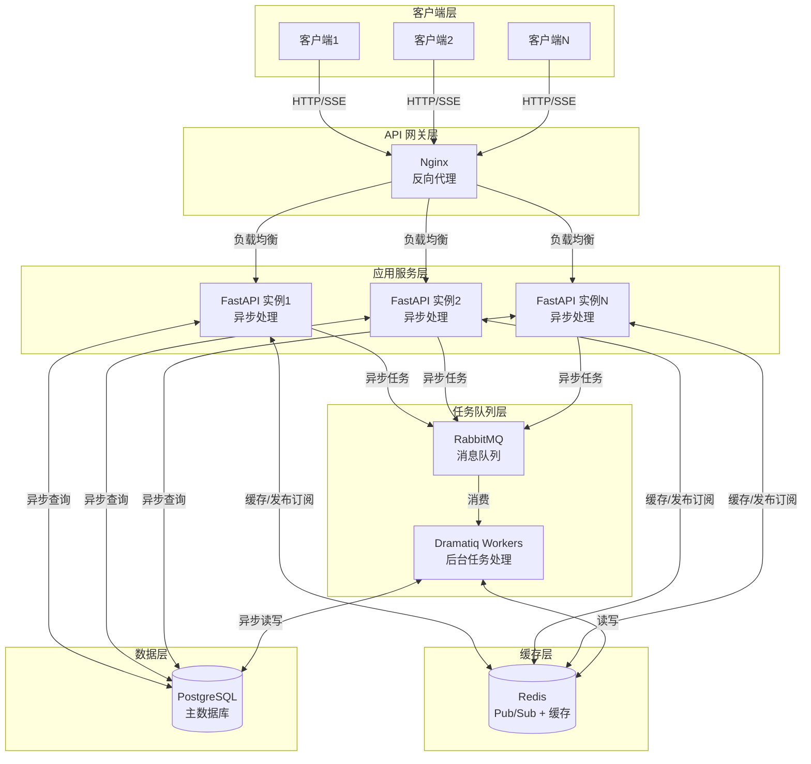

# Suna 并发架构深度分析

## 概述

本文档详细分析 Suna 系统中的并发架构，包括 Thread 概念的澄清、系统并发能力的实现机制，以及各层级的并发处理策略。

## Thread 概念澄清

### Suna 中的 Thread vs Python 的 thread

**重要区分**：Suna 中的 "Thread" 与 Python 的 "thread"（线程）是完全不同的概念。

#### Suna 的 Thread（对话线程）

```python
# Suna 中的 Thread 是一个数据模型，代表对话上下文
class Thread:
    thread_id: str      # UUID，对话线程标识
    project_id: str     # 所属项目
    account_id: str     # 所属账户
    messages: List      # 对话消息历史
    metadata: dict      # 元数据
```

- **本质**：业务领域概念，表示一个完整的对话会话
- **存储**：数据库中的一条记录
- **作用**：组织和管理多轮对话的上下文

#### Python 的 thread（系统线程）

```python
import threading

# Python 的 thread 是操作系统级别的执行单元
thread = threading.Thread(target=some_function)
thread.start()
```

- **本质**：操作系统的执行单元
- **存储**：内存中的执行上下文
- **作用**：实现并发执行

### 类比说明

```
Suna Thread ≈ "对话主题" 或 "聊天会话"
Python thread ≈ "工人" 或 "执行者"

一个 Suna Thread（对话）可以被多个 Python threads（工人）并发处理
```

## Suna 并发架构全景

### 1. 架构层次



### 2. 并发机制分层解析

在架构图中，"异步查询"（FastAPI ←→ PostgreSQL）表示：
- **非阻塞数据库访问**：FastAPI 实例使用异步客户端查询数据库
- **并发处理能力**：多个请求可以同时查询数据库而不相互阻塞
- **事件驱动模型**：基于 Python asyncio 的事件循环机制
- **连接池复用**：通过连接池管理数据库连接，避免频繁创建/销毁

## 一、FastAPI 层的异步并发

### 1. 异步请求处理

FastAPI 基于 Starlette 和 Python 的 asyncio，提供高性能的异步处理能力：

```python
# backend/api.py
@app.post("/api/agent/initiate")
async def initiate_agent_with_files(
    prompt: str = Form(...),
    files: List[UploadFile] = File(default=[]),
    user_id: str = Depends(get_current_user_id_from_jwt)
):
    """异步处理用户请求"""
    # 1. 异步数据库操作
    client = await db.client
    
    # 2. 并发创建资源
    project = await client.table('projects').insert({...}).execute()
    
    # 3. 异步文件处理
    for file in files:
        content = await file.read()  # 异步读取文件
        
    # 4. 发送到后台队列（非阻塞）
    run_agent_background.send(
        agent_run_id=agent_run_id,
        thread_id=thread_id,
        ...
    )
    
    # 5. 立即返回，不等待 AI 处理完成
    return {"thread_id": thread_id, "agent_run_id": agent_run_id}
```

### 2. 事件循环与协程

```python
# FastAPI 自动管理事件循环
# 每个请求都在协程中处理，不会阻塞其他请求

async def handle_multiple_requests():
    """演示并发处理多个请求"""
    # 这些请求会并发处理，不会相互阻塞
    tasks = [
        process_request_1(),
        process_request_2(),
        process_request_3(),
    ]
    results = await asyncio.gather(*tasks)
    return results
```

### 3. PostgreSQL 异步查询详解

#### 3.1 传统同步查询 vs 异步查询

**同步查询（阻塞式）**：
```python
# 同步查询 - 会阻塞整个线程
def get_user_sync(user_id):
    connection = psycopg2.connect(...)
    cursor = connection.cursor()
    cursor.execute("SELECT * FROM users WHERE id = %s", (user_id,))
    result = cursor.fetchone()  # 这里会阻塞，等待数据库返回
    return result

# 问题：查询期间无法处理其他请求，线程被阻塞
```

**异步查询（非阻塞式）**：
```python
# 异步查询 - 不会阻塞事件循环
async def get_user_async(user_id):
    # 使用异步数据库客户端
    async with asyncpg.create_pool(...) as pool:
        async with pool.acquire() as connection:
            # 异步执行查询，不阻塞其他请求
            result = await connection.fetchrow(
                "SELECT * FROM users WHERE id = $1", user_id
            )
            return result

# 优势：查询期间可以处理其他请求，事件循环继续运行
```

#### 3.2 Suna 中的异步数据库实现

```python
# backend/services/supabase.py
class DBConnection:
    def __init__(self):
        self._client = None
        self._pool = None  # 连接池
    
    async def initialize(self):
        """初始化异步数据库连接"""
        self._client = create_client(
            supabase_url=SUPABASE_URL,
            supabase_key=SUPABASE_KEY
        )
    
    @property
    async def client(self):
        """获取异步数据库客户端"""
        if not self._client:
            await self.initialize()
        return self._client

# 实际使用示例
async def create_thread(project_id: str, account_id: str):
    client = await db.client  # 异步获取客户端
    
    # 异步执行数据库插入
    thread = await client.table('threads').insert({
        "thread_id": str(uuid.uuid4()),
        "project_id": project_id,
        "account_id": account_id,
        "created_at": datetime.now(timezone.utc).isoformat()
    }).execute()
    
    return thread.data[0]
```

#### 3.3 并发数据库查询

```python
# 并发执行多个数据库查询
async def get_thread_data(thread_id: str):
    client = await db.client
    
    # 使用 asyncio.gather 并发执行多个查询
    results = await asyncio.gather(
        # 获取线程信息
        client.table('threads')
            .select('*')
            .eq('thread_id', thread_id)
            .execute(),
        
        # 获取消息列表
        client.table('messages')
            .select('*')
            .eq('thread_id', thread_id)
            .order('created_at', desc=False)
            .execute(),
        
        # 获取项目信息
        client.table('projects')
            .select('*')
            .eq('project_id', thread_id)
            .execute(),
        
        # 获取最新的 agent_run
        client.table('agent_runs')
            .select('*')
            .eq('thread_id', thread_id)
            .order('created_at', desc=True)
            .limit(1)
            .execute()
    )
    
    thread_data, messages, project, agent_run = results
    
    return {
        "thread": thread_data.data[0] if thread_data.data else None,
        "messages": messages.data,
        "project": project.data[0] if project.data else None,
        "latest_run": agent_run.data[0] if agent_run.data else None
    }
```

#### 3.4 连接池管理

```python
# 使用 asyncpg 实现高效的连接池
async def initialize_db_pool():
    """创建异步数据库连接池"""
    return await asyncpg.create_pool(
        dsn=DATABASE_URL,
        min_size=10,                         # 最小连接数
        max_size=20,                         # 最大连接数
        max_queries=50000,                   # 每个连接最大查询数
        max_inactive_connection_lifetime=300, # 空闲连接超时（秒）
        command_timeout=60,                  # 查询超时（秒）
        pool_recycle=3600                    # 连接回收时间（秒）
    )

# 连接池使用示例
class DatabaseManager:
    def __init__(self):
        self.pool = None
    
    async def initialize(self):
        self.pool = await initialize_db_pool()
    
    async def execute_query(self, query: str, *args):
        """使用连接池执行查询"""
        async with self.pool.acquire() as connection:
            # 连接会自动归还到池中
            return await connection.fetch(query, *args)
```

#### 3.5 异步查询的优势

1. **非阻塞 I/O**：
   - 查询数据库时不会阻塞事件循环
   - 其他请求可以继续处理
   - 单个进程可以处理更多并发请求

2. **高并发能力**：
   - 单个 FastAPI 实例可以同时处理多个数据库查询
   - 不需要为每个查询创建新线程

3. **资源效率**：
   - 减少线程创建和切换的开销
   - 通过连接池复用数据库连接
   - 降低内存占用

4. **更好的响应时间**：
   - 可以并发执行多个查询
   - 总延迟 = max(各查询时间) 而非 sum(各查询时间)

#### 3.6 批量操作优化

```python
# 批量插入消息，减少数据库往返
async def batch_insert_messages(messages: List[dict]):
    """批量插入消息"""
    client = await db.client
    
    # 单次批量插入，而不是循环插入
    result = await client.table('messages').insert(messages).execute()
    return result.data

# 批量更新状态
async def batch_update_status(agent_run_ids: List[str], status: str):
    """批量更新 agent_run 状态"""
    client = await db.client
    
    # 使用 IN 查询批量更新
    result = await client.table('agent_runs')\
        .update({"status": status, "updated_at": datetime.now().isoformat()})\
        .in_('id', agent_run_ids)\
        .execute()
    
    return result.data
```

#### 3.7 异步事务处理

```python
# 使用异步事务确保数据一致性
async def create_thread_with_message(project_id: str, user_message: str):
    """在事务中创建线程和初始消息"""
    async with db.pool.acquire() as connection:
        async with connection.transaction():
            # 创建线程
            thread_id = str(uuid.uuid4())
            await connection.execute("""
                INSERT INTO threads (thread_id, project_id, created_at)
                VALUES ($1, $2, $3)
            """, thread_id, project_id, datetime.now())
            
            # 创建消息
            message_id = str(uuid.uuid4())
            await connection.execute("""
                INSERT INTO messages (message_id, thread_id, type, content)
                VALUES ($1, $2, $3, $4)
            """, message_id, thread_id, 'user', json.dumps({
                "role": "user",
                "content": user_message
            }))
            
            # 如果任何操作失败，整个事务会回滚
            return thread_id
```

#### 3.8 性能监控

```python
# 监控异步查询性能
import time
from functools import wraps

def async_query_timer(func):
    """装饰器：记录异步查询执行时间"""
    @wraps(func)
    async def wrapper(*args, **kwargs):
        start = time.time()
        try:
            result = await func(*args, **kwargs)
            duration = time.time() - start
            
            # 记录慢查询
            if duration > 1.0:  # 超过1秒的查询
                logger.warning(
                    f"Slow query detected: {func.__name__} "
                    f"took {duration:.2f}s"
                )
            
            # 更新性能指标
            query_duration_histogram.observe(duration)
            
            return result
        except Exception as e:
            query_error_counter.inc()
            raise
    
    return wrapper

# 使用示例
@async_query_timer
async def get_thread_messages(thread_id: str):
    client = await db.client
    return await client.table('messages')\
        .select('*')\
        .eq('thread_id', thread_id)\
        .execute()
```

## 二、Dramatiq 后台任务并发

### 1. 任务队列架构

```python
# backend/run_agent_background.py
@dramatiq.actor
async def run_agent_background(
    agent_run_id: str,
    thread_id: str,
    instance_id: str,
    ...
):
    """后台异步处理 AI 任务"""
    # 1. 获取分布式锁，防止重复处理
    lock_key = f"agent_run_lock:{agent_run_id}"
    lock_acquired = await redis.set(lock_key, instance_id, nx=True, ex=TTL)
    
    if not lock_acquired:
        logger.info(f"Agent run {agent_run_id} already being processed")
        return
    
    # 2. 异步处理 AI 请求
    async for response in run_agent(...):
        # 3. 流式发布响应到 Redis
        await redis.rpush(response_list_key, json.dumps(response))
        await redis.publish(response_channel, "new")
```

### 2. Worker 并发配置

```python
# Dramatiq 配置多个 worker 进程
# 每个 worker 可以并发处理多个任务
dramatiq.set_broker(
    RabbitmqBroker(
        host="rabbitmq",
        middleware=[
            dramatiq.middleware.AsyncIO(),  # 支持异步任务
            dramatiq.middleware.Retries(),  # 自动重试
            dramatiq.middleware.TimeLimit(), # 超时控制
        ]
    )
)

# 启动多个 worker 进程
# dramatiq run_agent_background --processes 4 --threads 8
```

## 三、Redis 发布订阅并发

### 1. SSE 流式响应并发

```python
# backend/agent/api.py
@router.get("/agent-run/{agent_run_id}/stream")
async def stream_agent_run(agent_run_id: str):
    """SSE 流式响应，支持大量并发连接"""
    async def stream_generator():
        # 1. 创建独立的 Redis 订阅
        pubsub = await redis.create_pubsub()
        await pubsub.subscribe(f"agent_run:{agent_run_id}:new_response")
        
        try:
            # 2. 异步监听消息
            async for message in pubsub.listen():
                if message["type"] == "message":
                    # 3. 流式发送给客户端
                    yield f"data: {message['data']}\n\n"
        finally:
            # 4. 清理资源
            await pubsub.unsubscribe()
            await pubsub.close()
    
    return StreamingResponse(
        stream_generator(),
        media_type="text/event-stream"
    )
```

### 2. Redis 并发模式

```python
# Redis 键设计支持并发隔离
# 每个 agent_run 有独立的命名空间

# 响应列表（支持并发追加）
f"agent_run:{agent_run_id}:responses"

# 发布订阅频道（支持多订阅者）
f"agent_run:{agent_run_id}:new_response"

# 分布式锁（防止并发冲突）
f"agent_run_lock:{agent_run_id}"
```

## 四、并发控制与限制

### 1. 速率限制

```python
# 使用 Redis 实现分布式速率限制
async def rate_limit_check(user_id: str, limit: int = 100):
    """每用户每分钟请求限制"""
    key = f"rate_limit:{user_id}:{datetime.now().minute}"
    
    current = await redis.incr(key)
    if current == 1:
        await redis.expire(key, 60)
    
    if current > limit:
        raise HTTPException(429, "Rate limit exceeded")
```

### 2. 并发任务限制

```python
# 限制每个用户的并发 agent_run 数量
async def check_concurrent_runs(user_id: str, max_concurrent: int = 3):
    """检查用户并发运行数"""
    active_runs = await client.table('agent_runs')\
        .select('id')\
        .eq('account_id', user_id)\
        .eq('status', 'running')\
        .execute()
    
    if len(active_runs.data) >= max_concurrent:
        raise HTTPException(429, "Too many concurrent runs")
```

### 3. 资源隔离

```python
# 沙盒环境隔离
class SandboxManager:
    def create_sandbox(self, project_id: str):
        """每个项目独立的沙盒环境"""
        return Sandbox(
            id=f"sandbox_{project_id}",
            cpu_limit="1.0",      # CPU 限制
            memory_limit="2Gi",   # 内存限制
            disk_limit="10Gi",    # 磁盘限制
            network_isolated=True # 网络隔离
        )
```

## 五、并发性能优化策略

### 1. 连接复用

```python
# HTTP 客户端连接池
class LLMClient:
    def __init__(self):
        self.session = aiohttp.ClientSession(
            connector=aiohttp.TCPConnector(
                limit=100,          # 总连接数限制
                limit_per_host=30,  # 每个主机连接数
                ttl_dns_cache=300   # DNS 缓存
            )
        )
```

### 2. 批量操作

```python
# 批量数据库操作减少往返
async def batch_insert_messages(messages: List[dict]):
    """批量插入消息"""
    await client.table('messages').insert(messages).execute()
```

### 3. 缓存策略

```python
# 多级缓存减少数据库压力
class CacheManager:
    def __init__(self):
        self.local_cache = {}  # 进程内缓存
        self.redis = redis     # 分布式缓存
    
    async def get_with_cache(self, key: str):
        # 1. 本地缓存
        if key in self.local_cache:
            return self.local_cache[key]
        
        # 2. Redis 缓存
        value = await self.redis.get(key)
        if value:
            self.local_cache[key] = value
            return value
        
        # 3. 数据库查询
        value = await self.fetch_from_db(key)
        await self.redis.set(key, value, ex=300)
        self.local_cache[key] = value
        return value
```

## 六、监控与调试

### 1. 并发指标监控

```python
# 使用 Prometheus 监控并发指标
from prometheus_client import Counter, Gauge, Histogram

# 并发请求数
concurrent_requests = Gauge(
    'suna_concurrent_requests',
    'Number of concurrent requests'
)

# 请求处理时间
request_duration = Histogram(
    'suna_request_duration_seconds',
    'Request duration in seconds'
)

# 活跃 agent_run 数量
active_agent_runs = Gauge(
    'suna_active_agent_runs',
    'Number of active agent runs'
)
```

### 2. 异步调试技巧

```python
# 异步任务追踪
import contextvars

request_id = contextvars.ContextVar('request_id')

async def trace_async_execution():
    """追踪异步执行流程"""
    rid = str(uuid.uuid4())
    request_id.set(rid)
    
    logger.info(f"[{rid}] Starting async operation")
    
    # 异步操作会保持相同的 request_id
    await some_async_operation()
    
    logger.info(f"[{rid}] Completed async operation")
```

## 七、实际并发场景分析

### 场景 1：高并发用户请求

```
100 个用户同时发送消息：
1. Nginx 负载均衡分发到多个 FastAPI 实例
2. 每个 FastAPI 实例异步处理请求
3. 请求立即返回，任务发送到 RabbitMQ
4. Dramatiq workers 并发处理任务
5. 结果通过 Redis Pub/Sub 实时推送
```

### 场景 2：长时间 AI 处理

```
单个 AI 请求处理 30 秒：
1. 请求立即返回 agent_run_id
2. 客户端通过 SSE 连接等待结果
3. 后台 worker 处理不阻塞其他请求
4. 流式返回结果，用户体验良好
```

### 场景 3：突发流量

```
突然 1000 个请求：
1. 速率限制保护系统
2. 队列缓冲请求压力
3. 自动扩展 worker 数量
4. 优雅降级保证服务可用
```

## 最佳实践总结

### 1. 异步优先
- 所有 I/O 操作使用异步
- 避免阻塞事件循环
- 合理使用 asyncio.gather 并发

### 2. 任务解耦
- 快速响应与后台处理分离
- 使用消息队列缓冲压力
- 实现优雅的失败重试

### 3. 资源管理
- 连接池避免资源耗尽
- 合理设置超时时间
- 实施资源使用限制

### 4. 监控告警
- 实时监控并发指标
- 设置合理的告警阈值
- 保留详细的追踪日志

## 性能基准

基于当前架构，Suna 系统的并发处理能力：

- **API 层**：单实例可处理 1000+ 并发连接
- **SSE 连接**：支持 10000+ 并发长连接
- **后台任务**：可配置 N 个 worker，每个 worker M 个并发
- **数据库**：连接池支持 100+ 并发查询
- **Redis**：支持 50000+ 并发操作

## 总结

Suna 的并发架构通过多层次的异步处理、任务队列、发布订阅等机制，实现了高性能的并发处理能力。系统中的 "Thread" 是业务概念而非系统线程，整个架构基于 Python 的异步生态系统，充分利用了 FastAPI、asyncio、Dramatiq 等框架的并发特性，为用户提供了流畅的 AI 对话体验。