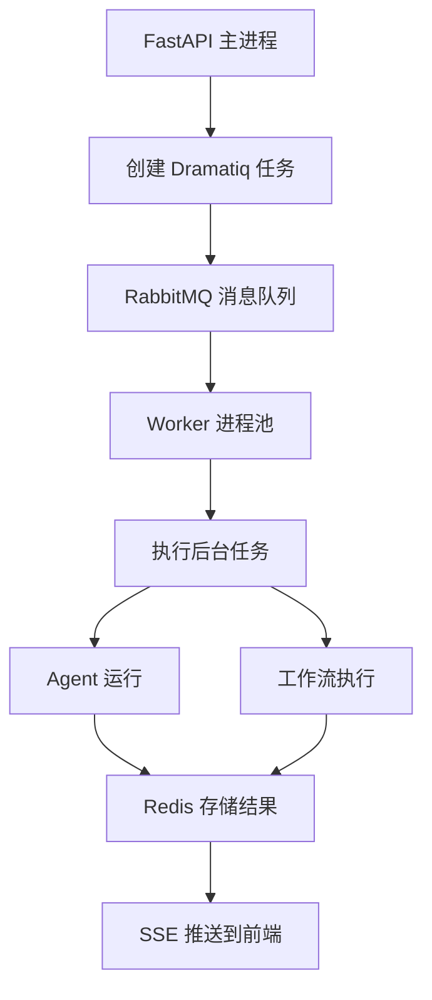

# Dramatiq 在 Suna 中的应用详解

## 什么是 Dramatiq？

Dramatiq 是一个 Python 分布式任务队列库，专为处理后台任务而设计。它的核心理念是：**简单、可靠、高性能**。

### 为什么选择 Dramatiq？

相比其他任务队列（如 Celery），Dramatiq 具有以下优势：

1. **更简单的配置** - 开箱即用，最小化配置
2. **内置错误处理** - 自动重试和死信队列
3. **更好的性能** - 轻量级设计，更少的开销
4. **清晰的 API** - 直观易用的装饰器模式
5. **更好的可靠性** - 消息不会丢失

## Dramatiq 核心概念

### 1. Actors（角色）

Actors 是被装饰的函数，可以异步执行：

```python
import dramatiq

@dramatiq.actor
def send_email(recipient, subject, body):
    # 发送邮件的逻辑
    pass

# 调用方式
send_email.send("user@example.com", "Hello", "Welcome!")
```

### 2. Messages（消息）

当你调用 `.send()` 时，Dramatiq 创建一个消息并发送到消息队列：

```python
# 消息结构
{
    "queue_name": "default",
    "actor_name": "send_email",
    "args": ["user@example.com", "Hello", "Welcome!"],
    "kwargs": {},
    "message_id": "unique-id",
    "message_timestamp": 1234567890
}
```

### 3. Brokers（代理）

Broker 是消息队列的抽象接口。Dramatiq 支持：
- **RabbitMQ** - 推荐用于生产环境
- **Redis** - 适合开发和小规模部署

### 4. Workers（工作者）

Workers 是从队列中取出消息并执行对应 actor 的进程。

## Suna 中的 Dramatiq 架构



## Suna 的 Dramatiq 配置

### 1. Broker 设置

```python
# backend/run_agent_background.py
from dramatiq.brokers.rabbitmq import RabbitmqBroker

rabbitmq_host = os.getenv('RABBITMQ_HOST', 'rabbitmq')
rabbitmq_port = int(os.getenv('RABBITMQ_PORT', 5672))

# 创建 RabbitMQ broker，启用异步中间件
rabbitmq_broker = RabbitmqBroker(
    host=rabbitmq_host, 
    port=rabbitmq_port, 
    middleware=[dramatiq.middleware.AsyncIO()]  # 支持异步函数
)

dramatiq.set_broker(rabbitmq_broker)
```

### 2. 定义 Actors

Suna 定义了三个主要的 actors：

#### a) 健康检查
```python
@dramatiq.actor
async def check_health(key: str):
    """健康检查任务"""
    await redis.set(key, "healthy", ex=redis.REDIS_KEY_TTL)
```

#### b) Agent 后台运行
```python
@dramatiq.actor
async def run_agent_background(
    agent_run_id: str,
    thread_id: str,
    instance_id: str,
    project_id: str,
    model_name: str,
    # ... 更多参数
):
    """在后台运行 AI Agent"""
    # 执行 Agent 逻辑
```

#### c) 工作流后台执行
```python
@dramatiq.actor
async def run_workflow_background(
    execution_id: str,
    workflow_id: str,
    workflow_name: str,
    workflow_definition: Dict[str, Any],
    # ... 更多参数
):
    """在后台执行工作流"""
    # 执行工作流逻辑
```

## 任务执行流程

### 1. 任务触发

当用户发送消息时，API 端点创建后台任务：

```python
# backend/agent/api.py
from run_agent_background import run_agent_background

# 创建任务
task = run_agent_background.send(
    agent_run_id=agent_run.id,
    thread_id=thread_id,
    instance_id=instance_id,
    # ... 其他参数
)
```

### 2. 消息队列

任务被序列化并发送到 RabbitMQ：
- 消息持久化到磁盘
- 支持多个 worker 并发处理
- 失败自动重试

### 3. Worker 处理

Worker 进程从队列取出任务并执行：

```python
# 任务执行的核心逻辑
async def run_agent_background(...):
    # 1. 初始化资源
    await initialize()
    
    # 2. 获取分布式锁（防止重复执行）
    lock_acquired = await redis.set(run_lock_key, instance_id, nx=True)
    
    # 3. 设置 Redis Pub/Sub 监听停止信号
    pubsub = await redis.create_pubsub()
    await pubsub.subscribe(control_channel)
    
    # 4. 执行 Agent 逻辑
    async for response in run_agent(...):
        # 存储响应到 Redis
        await redis.rpush(response_list_key, json.dumps(response))
        # 发布通知
        await redis.publish(response_channel, "new")
    
    # 5. 更新数据库状态
    await update_agent_run_status(...)
```

## 高级特性应用

### 1. 幂等性保证

使用 Redis 分布式锁防止重复执行：

```python
# 尝试获取锁
run_lock_key = f"agent_run_lock:{agent_run_id}"
lock_acquired = await redis.set(run_lock_key, instance_id, nx=True, ex=TTL)

if not lock_acquired:
    logger.info(f"Agent run {agent_run_id} already processing")
    return
```

### 2. 优雅停止

通过 Redis Pub/Sub 实现任务停止：

```python
async def check_for_stop_signal():
    while not stop_signal_received:
        message = await pubsub.get_message()
        if message and message.get("data") == "STOP":
            stop_signal_received = True
            break
```

### 3. 流式响应

使用 Redis 实现实时数据流：

```python
# Worker 端：发布响应
await redis.rpush(response_list_key, response_json)
await redis.publish(response_channel, "new")

# API 端：SSE 流式返回
async def stream_responses():
    pubsub = redis.pubsub()
    await pubsub.subscribe(response_channel)
    
    async for message in pubsub.listen():
        yield f"data: {message['data']}\n\n"
```

### 4. 错误处理

完整的错误处理和状态更新：

```python
try:
    # 执行任务
    async for response in run_agent(...):
        # 处理响应
except Exception as e:
    # 记录错误
    logger.error(f"Error: {e}")
    
    # 更新状态
    await update_agent_run_status(
        status="failed",
        error=str(e)
    )
    
    # 发布错误信号
    await redis.publish(control_channel, "ERROR")
finally:
    # 清理资源
    await cleanup_resources()
```

## 性能优化

### 1. 连接池管理

```python
# Redis 连接池
redis_pool = await aioredis.create_redis_pool(
    'redis://localhost',
    minsize=5,
    maxsize=10
)
```

### 2. 批量操作

```python
# 批量发送 Redis 操作
pending_operations = []
for response in responses:
    pending_operations.append(
        asyncio.create_task(redis.rpush(key, response))
    )

# 等待所有操作完成
await asyncio.gather(*pending_operations)
```

### 3. TTL 管理

自动清理过期数据：

```python
# 设置响应列表 TTL（24小时）
REDIS_RESPONSE_LIST_TTL = 3600 * 24
await redis.expire(response_list_key, REDIS_RESPONSE_LIST_TTL)
```

## 监控和调试

### 1. 日志记录

```python
logger.info(f"Starting agent run: {agent_run_id}")
logger.info(f"Model: {model_name}, Instance: {instance_id}")
```

### 2. Sentry 集成

```python
sentry.sentry.set_tag("thread_id", thread_id)
sentry_sdk.set_tag("workflow_id", workflow_id)
```

### 3. 性能追踪

```python
# Langfuse 追踪
trace = langfuse.trace(
    name="agent_run",
    id=agent_run_id,
    session_id=thread_id
)
```

## Worker 管理

### 启动 Workers

```bash
# 启动 Dramatiq workers
dramatiq run_agent_background --processes 4 --threads 8
```

### Docker Compose 配置

```yaml
# backend/docker-compose.yml
worker:
  build: .
  command: dramatiq run_agent_background
  environment:
    - RABBITMQ_HOST=rabbitmq
    - REDIS_URL=redis://redis:6379
  depends_on:
    - rabbitmq
    - redis
```

## 最佳实践

### 1. 任务设计
- 保持任务原子性
- 避免在任务中执行长时间阻塞操作
- 使用异步 I/O

### 2. 错误处理
- 总是捕获并记录异常
- 更新任务状态到数据库
- 发送错误通知

### 3. 资源管理
- 正确清理连接和资源
- 使用 `finally` 块确保清理执行
- 设置合理的超时

### 4. 可观测性
- 详细的日志记录
- 性能指标收集
- 错误追踪

## 故障排除

### 常见问题

1. **任务未执行**
   - 检查 RabbitMQ 连接
   - 确认 Worker 进程运行
   - 查看任务队列状态

2. **任务重复执行**
   - 检查分布式锁机制
   - 确认消息确认机制

3. **内存泄漏**
   - 检查资源清理
   - 监控 Worker 内存使用

### 调试命令

```bash
# 查看队列状态
rabbitmqctl list_queues

# 查看 Worker 日志
docker logs suna-worker

# 监控 Redis
redis-cli monitor
```

## 总结

Dramatiq 在 Suna 中扮演着关键角色：

1. **解耦架构** - API 和任务执行分离
2. **可扩展性** - 轻松增加 Worker 处理能力
3. **可靠性** - 自动重试和错误处理
4. **实时性** - 配合 Redis 实现流式响应

通过合理使用 Dramatiq，Suna 能够：
- 处理长时间运行的 AI 任务
- 支持并发用户请求
- 提供实时的任务进度反馈
- 保证系统的稳定性和可靠性

这种设计让 Suna 成为一个真正的生产级 AI 应用平台。