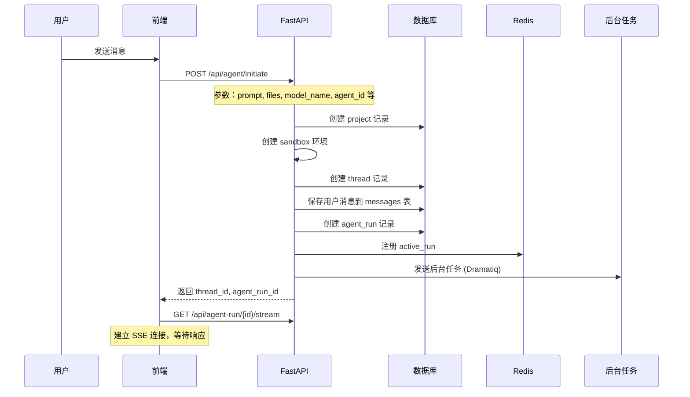
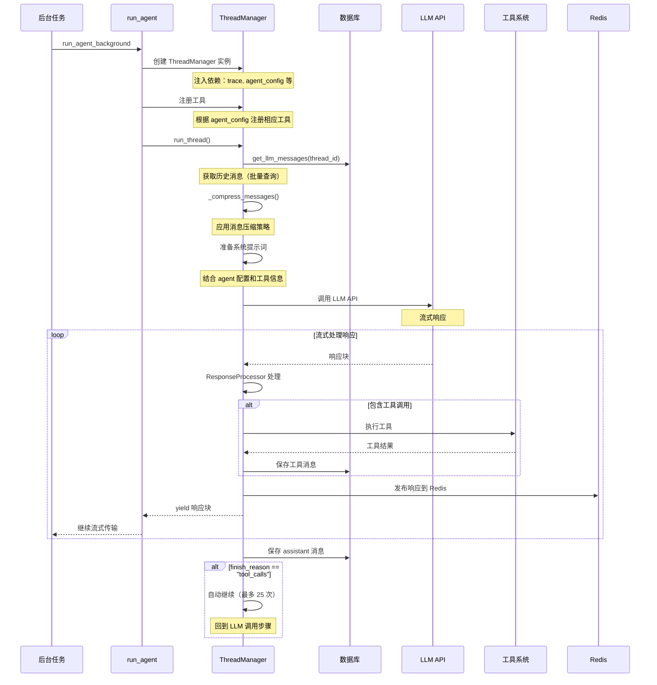
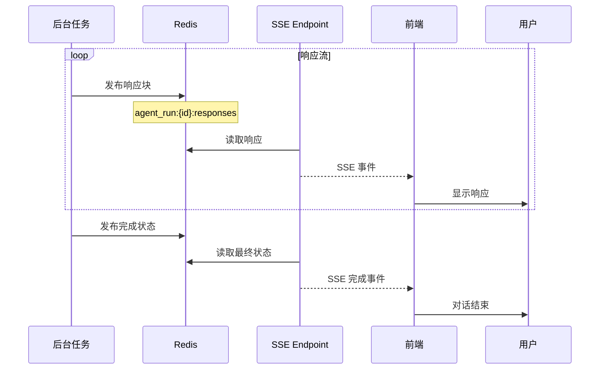
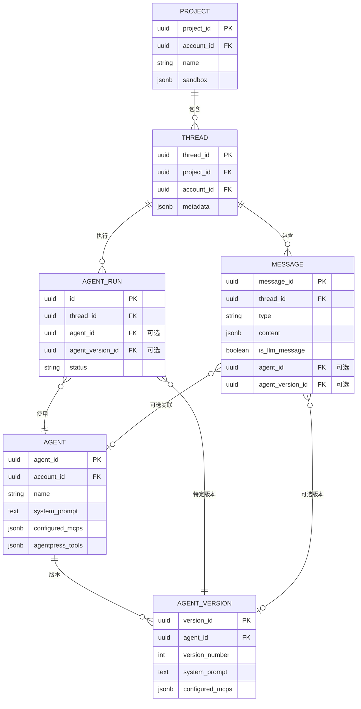
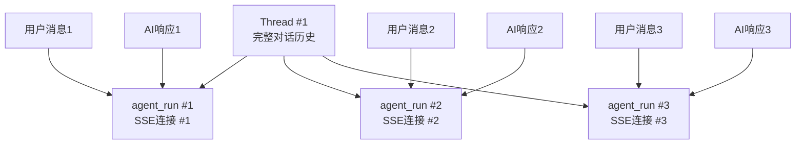

# ThreadManager 深度分析报告

## 概述

ThreadManager 是 Suna 项目中的核心组件，负责管理 AI Agent 与用户之间的对话线程。它是整个对话系统的中枢，协调了消息管理、工具执行、LLM 交互和上下文管理等多个关键功能。

作为 Suna 中的**对话编排器**，ThreadManager 位于应用层和底层服务之间，扮演着"指挥家"的角色。它不仅管理对话状态，还负责智能的上下文优化、工具执行协调、流式响应管理等关键任务。

## 核心职责

### 1. **对话状态管理中心**
ThreadManager 维护了整个对话的完整状态：
- 内存中的消息缓存
- 消息的持久化存储
- Agent 版本追踪
- 用户权限验证

### 2. **智能上下文优化器**
实现了多层次的上下文压缩策略：
- 三阶段渐进式压缩（工具结果→用户消息→助手消息）
- 保留关键信息（系统消息和最近的消息）
- 智能截断（保留消息开头和结尾）
- 引用机制（压缩后包含原始 message_id）

### 3. **工具执行协调器**
协调工具的注册、调用和结果处理：
- 准备工具 schemas
- 调用 LLM 时包含工具定义
- 通过 ResponseProcessor 处理工具调用
- 支持并行和顺序执行模式

### 4. **流式响应管理器**
支持实时流式输出：
- 实时输出内容块
- 检测并执行工具调用
- 流式传输执行结果

### 5. **错误处理与恢复**
提供全面的错误处理机制：
- 异常捕获和日志记录
- 优雅降级策略
- 错误状态传播

## 架构设计

### 1. 类结构

```python
class ThreadManager:
    def __init__(self, thread_id: str, account_id: str, db_connection, ...):
        self.thread_id = thread_id                  # 对话线程 ID
        self.account_id = account_id                # 账户 ID（权限控制）
        self.messages = []                          # 内存中的消息缓存
        self.tool_registry = ToolRegistry()         # 工具注册表
        self.response_processor = ResponseProcessor() # 响应处理器
        self.context_manager = ContextManager()     # 上下文管理器
        self.db_connection = db_connection          # 数据库连接
```

ThreadManager 采用了清晰的组件化设计，每个组件都有明确的职责：
- **DBConnection**: 处理所有数据库操作
- **ToolRegistry**: 统一管理所有可用工具
- **ResponseProcessor**: 解析 LLM 响应，检测和执行工具调用
- **ContextManager**: 管理 token 计数和消息摘要

### 2. 核心组件交互

```
┌─────────────────┐     ┌──────────────────┐     ┌─────────────────┐
│  ThreadManager  │────▶│  ToolRegistry    │────▶│     Tools       │
└────────┬────────┘     └──────────────────┘     └─────────────────┘
         │
         │              ┌──────────────────┐     ┌─────────────────┐
         ├─────────────▶│ResponseProcessor │────▶│   LLM Service   │
         │              └──────────────────┘     └─────────────────┘
         │
         │              ┌──────────────────┐     ┌─────────────────┐
         └─────────────▶│ ContextManager   │────▶│    Database     │
                        └──────────────────┘     └─────────────────┘
```

## 完整的请求处理流程

### 1. 用户发起请求到服务端接收



### 2. ThreadManager 处理请求的详细流程



### 3. 响应返回给用户



## 核心概念关系说明

### 1. Project、Thread、Message、Agent 的关系



### 2. 关键特性说明

1. **Agent-Agnostic Threads（线程不绑定 Agent）**
   - Thread 不再固定关联特定 Agent
   - 每次 agent_run 可以选择不同的 Agent
   - 支持在同一对话中切换 Agent

2. **消息类型系统**
   - `user`: 用户消息
   - `assistant`: AI 响应
   - `tool`: 工具执行结果
   - `browser_state`: 浏览器状态（包含截图）
   - `browser_action`: 浏览器操作
   - `status`: 系统状态消息

3. **Agent 版本管理**
   - 每个 Agent 可以有多个版本
   - agent_runs 和 messages 记录使用的具体版本
   - 支持版本回滚和历史追踪

4. **工具系统**
   - 动态注册工具
   - 支持 XML 和 OpenAPI 格式
   - 支持 MCP（Model Context Protocol）工具
   - 工具执行策略可配置（串行/并行）

### 3. SSE 连接与 Thread、Agent Run 的关系

#### SSE 连接映射关系

**核心概念：一个 SSE 连接 = 一个 agent_run，而不是一个 thread**

```
GET /api/agent-run/{agent_run_id}/stream
```

- 每个 SSE 连接通过 `agent_run_id` 来标识
- 一个 `agent_run` 代表一次 AI 处理会话
- SSE 连接用于流式传输这次 agent_run 的响应

#### Thread 与 Agent Run 的关系

一个 Thread 可以有多个 agent_run：



#### 实际工作流程

1. **用户发送第一条消息**
   - 创建 Thread（如果是新对话）
   - 创建第一个 agent_run
   - 建立 SSE 连接监听第一个 agent_run
   - 前端订阅：`GET /api/agent-run/{agent_run_id_1}/stream`

2. **用户发送后续消息**
   - 使用同一个 Thread
   - 创建新的 agent_run
   - 建立新的 SSE 连接监听新的 agent_run
   - 前端订阅：`GET /api/agent-run/{agent_run_id_2}/stream`

#### Redis 键结构

每个 agent_run 有独立的 Redis 键空间：

```python
# 响应列表（存储所有响应块）
agent_run:{agent_run_id}:responses

# 新响应通知频道（发布新响应事件）
agent_run:{agent_run_id}:new_response

# 控制信号频道（停止、错误等信号）
agent_run:{agent_run_id}:control

# 活跃运行标记
active_run:{instance_id}:{agent_run_id}
```

#### 为什么这样设计？

1. **隔离性**：每次对话轮次独立，避免消息混乱
2. **可追踪**：每个 agent_run 可以独立追踪状态、错误、耗时等
3. **并发安全**：多个 agent_run 可以并发执行而不相互干扰
4. **断线重连**：客户端可以通过 agent_run_id 重新连接获取历史响应
5. **Agent 切换**：同一个 Thread 的不同 agent_run 可以使用不同的 Agent

#### 概念总结

- **Thread** = 整个对话历史（包含多轮对话）
- **agent_run** = 一次 AI 处理过程（一轮对话）
- **SSE 连接** = 监听一个特定 agent_run 的响应流
- **Message** = Thread 中的单条消息（用户、助手或工具消息）

这种设计让系统更加灵活和可靠，支持复杂的对话场景，如并发处理、中断恢复、Agent 切换等高级功能。

## 核心方法分析

### 1. 消息管理

#### `add_message()`
```python
async def add_message(
    self,
    thread_id: str,
    type: str,
    content: Union[Dict[str, Any], List[Any], str],
    is_llm_message: bool = False,
    metadata: Optional[Dict[str, Any]] = None,
    agent_id: Optional[str] = None,
    agent_version_id: Optional[str] = None
)
```

- **功能**：将消息持久化到数据库
- **特点**：
  - 支持多种内容类型（字典、列表、字符串）
  - 区分 LLM 消息和用户消息
  - 支持 Agent 版本追踪
  - 返回完整的消息对象（包含 message_id）

#### `get_llm_messages()`

批量消息加载机制，避免内存溢出：

```python
def get_llm_messages(self, agent_version_id):
    """批量加载消息，每批 1000 条"""
    all_messages = []
    offset = 0
    batch_size = 1000
    
    while True:
        batch = self._fetch_messages_batch(
            agent_version_id, 
            limit=batch_size, 
            offset=offset
        )
        if not batch:
            break
        all_messages.extend(batch)
        offset += batch_size
    
    return all_messages
```

- **功能**：获取线程中所有 LLM 相关消息
- **特点**：
  - 批量获取（每批 1000 条）避免内存溢出
  - 自动解析 JSON 内容
  - 保留 message_id 用于后续引用

### 2. 上下文压缩策略

ThreadManager 实现了多层次的上下文压缩策略，以适应不同 LLM 的 token 限制：

#### 2.1 消息压缩（`_compress_messages()`）

```python
def _compress_messages(
    self, 
    messages: List[Dict[str, Any]], 
    llm_model: str, 
    max_tokens: Optional[int] = 41000,
    token_threshold: Optional[int] = 4096,
    max_iterations: int = 5
) -> List[Dict[str, Any]]
```

**压缩策略的精髓**：

1. **模型特定的上下文窗口自适应**：
   ```python
   def _get_context_window(self, model: str) -> int:
       """根据模型返回上下文窗口大小"""
       if "claude-3-5-sonnet" in model:
           return 108_000  # 200K - 64K(输出) - 28K(安全边界)
       elif model.startswith("gpt"):
           return 100_000  # 128K - 28K(预留)
       elif "gemini" in model:
           return 700_000  # 1M - 300K(预留)
       elif "deepseek" in model:
           return 100_000
       else:
           return 50_000  # 保守默认值
   ```

2. **三阶段渐进式压缩**：
   ```python
   def _compress_context(self, messages, model):
       """三阶段渐进式压缩"""
       # 获取模型特定的 token 限制
       context_window = self._get_context_window(model)
       
       # 第一阶段：压缩工具结果（影响最小）
       if tokens_used > context_window:
           messages = self._compress_messages_pass_1(messages)
       
       # 第二阶段：压缩用户消息（保留关键指令）
       if tokens_used > context_window:
           messages = self._compress_messages_pass_2(messages)
       
       # 第三阶段：压缩助手消息（最后手段）
       if tokens_used > context_window:
           messages = self._compress_messages_pass_3(messages)
   ```

3. **递归压缩**：如果压缩后仍超限，减半阈值继续压缩

#### 2.2 消息截断的艺术

压缩不是简单的截断，而是保留关键信息：

**安全截断（`_safe_truncate()`）**：
```python
def _safe_truncate(self, content: str, max_length: int) -> str:
    """智能截断，保留开头和结尾"""
    if len(content) <= max_length:
        return content
    
    # 计算保留长度
    keep_start = max_length // 3
    keep_end = max_length // 3
    
    return (
        content[:keep_start] +
        "\n...(middle truncated)...\n" +
        content[-keep_end:]
    )
```

**消息引用压缩（`_compress_message()`）**：
```python
def _compress_message(self, message: dict, target_length: int):
    """智能压缩单条消息"""
    content = message['content']
    
    if len(content) <= target_length:
        return message
    
    # 计算保留的开头和结尾长度
    keep_start = target_length // 3
    keep_end = target_length // 3
    
    compressed = (
        content[:keep_start] + 
        f"\n... [省略 {len(content) - target_length} 字符] ...\n" +
        content[-keep_end:]
    )
    
    # 添加原始消息引用
    compressed += f"\n[查看完整消息: {message['id']}]"
    
    return {**message, 'content': compressed}
```

#### 2.3 消息删除策略（`_compress_messages_by_omitting_messages()`）

当其他压缩策略无效时：
- 保留系统消息
- 从中间批量删除消息（每批 10 条）
- 最少保留 10 条消息
- 优先保留最新和最早的上下文

### 3. 线程执行（`run_thread()`）

这是 ThreadManager 的核心方法，负责执行一次完整的对话轮次：

```python
async def run_thread(
    self,
    thread_id: str,
    system_prompt: Dict[str, Any],
    stream: bool = True,
    temporary_message: Optional[Dict[str, Any]] = None,
    llm_model: str = "gpt-4o",
    llm_temperature: float = 0,
    llm_max_tokens: Optional[int] = None,
    processor_config: Optional[ProcessorConfig] = None,
    tool_choice: ToolChoice = "auto",
    native_max_auto_continues: int = 25,
    max_xml_tool_calls: int = 0,
    include_xml_examples: bool = False,
    enable_thinking: Optional[bool] = False,
    reasoning_effort: Optional[str] = 'low',
    enable_context_manager: bool = True,
    generation: Optional[StatefulGenerationClient] = None,
) -> Union[Dict[str, Any], AsyncGenerator]
```

**执行流程**：

1. **准备阶段**：
   ```python
   # 获取历史消息并计算 token
   messages = await self.get_llm_messages(agent_version_id)
   tokens_used = self._count_tokens(messages, model)
   
   # 应用压缩策略
   if tokens_used > context_window:
       messages = self._compress_context(messages, model)
   
   # 准备工具 schemas
   tools = self.tool_registry.get_openapi_schemas()
   ```

2. **LLM 调用**：
   ```python
   # 调用 LLM 时包含工具定义
   llm_response = await make_llm_api_call(
       messages=messages,
       tools=tools,
       stream=stream,
       model=llm_model,
       temperature=llm_temperature,
       max_tokens=llm_max_tokens
   )
   ```

3. **响应处理**：
   ```python
   # 通过 ResponseProcessor 处理工具调用
   async for state in self.response_processor.process_response(
       llm_response,
       stream=stream
   ):
       if state.type == "content":
           yield state.data
       elif state.type == "tool_result":
           # 保存工具结果
           await self.add_message("tool", state.data)
   ```

4. **自动继续机制**：
   ```python
   while auto_continue and iteration < max_iterations:
       # 检测是否有工具调用
       if self._has_tool_calls(ai_message):
           # 执行工具并获取结果
           tool_results = await self._execute_tools(tool_calls)
           
           # 将结果添加到对话
           self.add_message("tool", tool_results)
           
           # 继续下一轮对话
           ai_message = await self.run_thread(None, ...)
           iteration += 1
       else:
           break
   ```

### 4. 工具管理

#### `add_tool()`
```python
def add_tool(self, tool_class: Type[Tool], function_names: Optional[List[str]] = None, **kwargs)
```

- 动态注册工具类
- 支持选择性注册特定函数
- 传递初始化参数

## 实现原理深度解析

### 1. **流式响应管理**

支持实时流式输出，提升用户体验：

```python
async def handle_stream_response(self, response_stream):
    """处理流式响应"""
    async for chunk in response_stream:
        # 实时输出内容
        if chunk.type == "content":
            yield chunk.data
        
        # 检测并执行工具调用
        elif chunk.type == "tool_call":
            result = await self.execute_tool(chunk.data)
            yield result
```

### 2. **与其他组件的交互**

- **ToolRegistry**: ThreadManager 通过 `add_tool()` 方法注册工具，在运行时通过 registry 获取工具 schema
- **ResponseProcessor**: 负责处理 LLM 响应，检测和执行工具调用，处理流式/非流式响应
- **ContextManager**: 管理 token 计数和消息摘要（虽然当前摘要功能被注释掉了）
- **LLM Service**: 通过 `make_llm_api_call()` 与各种 LLM 提供商通信

## 设计模式与最佳实践

### 1. 依赖注入
- ThreadManager 通过构造函数接收所有依赖
- 便于测试和模块化

### 2. 回调模式
- `add_message_callback` 解耦了消息存储逻辑
- ResponseProcessor 可以独立处理消息持久化

### 3. 策略模式
- 多种压缩策略可根据情况选择
- 工具执行策略（sequential/parallel）可配置

### 4. 装饰器模式
- 工具通过装饰器定义，简化了工具开发
- XML 和 OpenAPI 格式通过装饰器指定

### 5. 单一职责原则
- ThreadManager 只负责对话流程编排
- 具体的工具执行、LLM 调用都委托给专门的组件

### 6. 开闭原则
- 通过 ToolRegistry 动态注册工具
- 支持新模型只需添加配置，不需修改核心逻辑

## 性能优化

1. **批量查询**：消息获取使用批量查询（1000条/批）
2. **流式处理**：支持流式响应，减少延迟
3. **智能压缩**：多级压缩策略，最大化利用上下文窗口
4. **并行执行**：支持工具并行执行（可配置）
5. **Redis 缓存**：使用 Redis 进行响应缓存和状态管理

## 错误处理

1. **全面的异常捕获**：每个关键操作都有 try-catch
2. **详细的日志记录**：使用结构化日志记录关键信息
3. **优雅降级**：压缩失败时自动切换到消息删除策略
4. **错误传播**：通过生成器 yield 错误状态
5. **幂等性保证**：使用 Redis 锁防止重复执行

## 扩展性设计

1. **工具系统**：通过 ToolRegistry 轻松添加新工具
2. **LLM 支持**：通过配置支持不同的 LLM 模型
3. **消息类型**：灵活的消息类型系统，易于扩展
4. **处理策略**：ProcessorConfig 允许自定义处理行为
5. **MCP 集成**：支持动态加载 MCP 服务器工具

## 安全考虑

1. **Agent 隔离**：支持 agent_id 和 version_id 追踪
2. **权限控制**：通过 account_id 进行访问控制
3. **输入验证**：对所有输入进行类型检查和验证
4. **资源限制**：通过 token 限制和迭代次数限制防止滥用
5. **沙盒隔离**：每个项目运行在独立的沙盒环境中

## 实时性保证

1. **SSE 流式传输**：使用 Server-Sent Events 实现实时响应
2. **Redis Pub/Sub**：通过 Redis 发布订阅模式实现跨进程通信
3. **异步处理**：全程使用异步 I/O，提高并发性能
4. **后台任务**：使用 Dramatiq 进行任务队列管理

## 设计哲学与架构优势

### 设计哲学

1. **关注点分离**：ThreadManager 只负责对话流程编排，具体的工具执行、LLM 调用都委托给专门的组件
2. **渐进式降级**：当上下文超限时，不是简单报错，而是通过多层压缩策略尽可能保留信息
3. **可观测性**：完整的日志记录和消息追踪，便于调试和监控
4. **扩展性**：通过 ToolRegistry 动态注册工具，支持新模型只需添加配置

### 架构优势

1. **灵活性**：
   - 支持多种 LLM 提供商和工具调用格式
   - 可以轻松添加新的工具和调用格式
   - 支持自定义执行策略

2. **安全性**：
   - 所有工具在 Docker 容器中隔离执行
   - 完整的权限控制和资源限制
   - 错误隔离，不会影响主进程

3. **性能**：
   - 支持并行执行提高效率
   - 流式处理减少延迟
   - 智能缓存减少重复调用

4. **可维护性**：
   - 清晰的分层架构
   - 统一的错误处理
   - 完善的日志和监控

## 总结

ThreadManager 是一个设计精良的对话管理系统，通过清晰的职责分离、灵活的配置选项和强大的错误处理机制，为 Suna 平台提供了可靠的对话管理能力。其多层次的上下文压缩策略和自动继续机制确保了在各种 LLM 限制下都能提供流畅的对话体验。

ThreadManager 的设计体现了软件工程的最佳实践：单一职责、依赖倒置、开闭原则。它不仅是一个消息管理器，更是整个对话系统的智能调度中心。通过精心设计的多层架构，ThreadManager 实现了 LLM 与外部工具的无缝集成，为构建强大的 AI Agent 提供了坚实的基础。

从用户请求到最终响应的完整链路中，ThreadManager 作为核心组件，协调了前端 API、数据库存储、LLM 服务、工具执行和实时响应传输等多个环节，实现了一个高性能、可扩展的 AI 对话系统。

## 相关文档

- [聊天流程分析](./chat-flow-analysis.md) - 了解完整的端到端流程
- [架构总览](./architecture-overview.md) - 了解 ThreadManager 在整体架构中的位置
- [工具系统架构](../03-tool-system/tool-system-architecture.md) - 了解工具系统的集成
- [异步任务架构](./async-task-architecture.md) - 了解异步处理机制