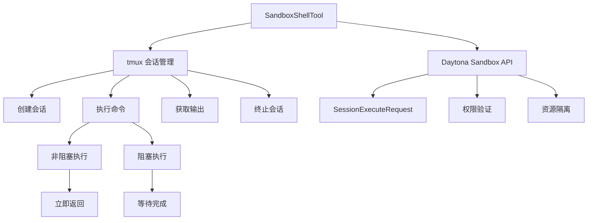
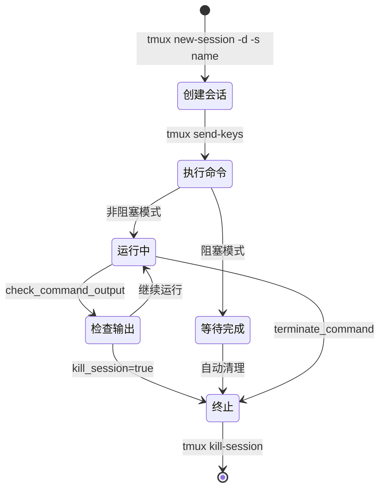

# SandboxShellTool 完整指南

## 概述

`SandboxShellTool` 是 Suna 系统中最核心的工具之一，负责在安全的沙箱环境中执行命令行操作。它通过 tmux 会话管理提供了强大的命令执行能力，支持长时间运行的任务、会话状态保持和输出监控。

## 核心特性

### 1. **基于 tmux 的会话管理**
- 每个命令在独立的 tmux 会话中执行
- 支持命名会话，便于管理相关任务
- 会话间相互隔离，互不影响

### 2. **阻塞与非阻塞执行**
- **非阻塞模式**（默认）：适合长时间运行的任务如开发服务器
- **阻塞模式**：等待命令完成并返回完整输出

### 3. **沙箱安全隔离**
- 所有命令在 Daytona 沙箱环境中执行
- 限制在 `/workspace` 目录内操作
- 通过 API 调用而非直接执行，增加安全层

## 架构设计



## 核心方法详解

### 1. execute_command - 执行命令

```python
async def execute_command(
    self, 
    command: str,                    # 要执行的命令
    folder: Optional[str] = None,    # 相对路径（基于 /workspace）
    session_name: Optional[str] = None,  # tmux 会话名
    blocking: bool = False,          # 是否阻塞等待
    timeout: int = 60               # 阻塞模式的超时时间
) -> ToolResult
```

#### 执行流程：

1. **准备工作目录**
   ```python
   cwd = self.workspace_path  # /workspace
   if folder:
       folder = folder.strip('/')
       cwd = f"{self.workspace_path}/{folder}"
   ```

2. **会话管理**
   ```python
   # 自动生成会话名（如果未提供）
   if not session_name:
       session_name = f"session_{str(uuid4())[:8]}"
   
   # 检查会话是否存在
   check_session = await self._execute_raw_command(
       f"tmux has-session -t {session_name} 2>/dev/null || echo 'not_exists'"
   )
   ```

3. **命令执行**
   ```python
   # 构建完整命令（包含目录切换）
   full_command = f"cd {cwd} && {command}"
   
   # 发送到 tmux 会话
   await self._execute_raw_command(
       f'tmux send-keys -t {session_name} "{wrapped_command}" Enter'
   )
   ```

4. **阻塞模式处理**
   - 轮询检查输出
   - 识别完成标志（$、#、>、Done 等）
   - 超时控制
   - 返回完整输出

### 2. check_command_output - 检查输出

```python
async def check_command_output(
    self,
    session_name: str,
    kill_session: bool = False
) -> ToolResult
```

#### 功能说明：
- 获取指定 tmux 会话的当前输出
- 可选择性地终止会话
- 用于监控长时间运行的任务

### 3. terminate_command - 终止命令

```python
async def terminate_command(
    self,
    session_name: str
) -> ToolResult
```

#### 功能说明：
- 强制终止指定的 tmux 会话
- 用于停止长时间运行的进程
- 清理资源

### 4. list_commands - 列出所有会话

```python
async def list_commands(self) -> ToolResult
```

#### 功能说明：
- 列出所有活跃的 tmux 会话
- 帮助管理多个并行任务

## tmux 会话管理机制

### 会话生命周期



### 会话命名策略

1. **自动生成**：`session_12345678`（8位随机）
2. **语义命名**：`dev_server`、`build_process`
3. **复用会话**：相同名称的命令在同一会话执行

## 🚀 快速开始

### 基础命令执行

```xml
<!-- 查看当前目录 -->
<execute-command>
pwd
</execute-command>

<!-- 列出文件 -->
<execute-command>
ls -la
</execute-command>

<!-- 创建目录结构 -->
<execute-command>
mkdir -p src/components src/utils tests
</execute-command>
```

## 📦 项目管理场景

### 1. Node.js 项目初始化

```xml
<!-- 步骤1: 创建项目并初始化 -->
<execute-command session_name="node_project" blocking="true">
mkdir my-app && cd my-app && npm init -y
</execute-command>

<!-- 步骤2: 安装依赖（阻塞等待完成） -->
<execute-command session_name="node_project" blocking="true" timeout="300">
npm install express cors dotenv
</execute-command>

<!-- 步骤3: 创建入口文件 -->
<execute-command session_name="node_project">
echo 'console.log("Hello Suna!")' > index.js
</execute-command>

<!-- 步骤4: 运行项目（非阻塞） -->
<execute-command session_name="node_server">
node index.js
</execute-command>

<!-- 步骤5: 检查服务器输出 -->
<check-command-output session_name="node_server" />
```

### 2. Python 项目配置

```xml
<!-- 创建虚拟环境 -->
<execute-command session_name="python_env" blocking="true">
python -m venv venv && source venv/bin/activate && pip install --upgrade pip
</execute-command>

<!-- 安装依赖 -->
<execute-command session_name="python_env" blocking="true" timeout="180">
source venv/bin/activate && pip install flask pandas numpy
</execute-command>

<!-- 运行 Python 脚本 -->
<execute-command session_name="python_app">
source venv/bin/activate && python app.py
</execute-command>
```

## 🛠️ 开发工作流

### 1. 前后端同时开发

```xml
<!-- 启动后端 API 服务器 -->
<execute-command session_name="backend" folder="backend">
npm run dev
</execute-command>

<!-- 启动前端开发服务器 -->
<execute-command session_name="frontend" folder="frontend">
npm run dev
</execute-command>

<!-- 检查两个服务的状态 -->
<check-command-output session_name="backend" />
<check-command-output session_name="frontend" />

<!-- 查看所有运行的服务 -->
<list-commands />
```

### 2. 数据库操作

```xml
<!-- 启动 PostgreSQL（Docker） -->
<execute-command session_name="postgres">
docker run -d --name postgres -e POSTGRES_PASSWORD=secret -p 5432:5432 postgres
</execute-command>

<!-- 运行数据库迁移 -->
<execute-command session_name="db_migrate" blocking="true">
npm run migrate:latest
</execute-command>

<!-- 导入测试数据 -->
<execute-command session_name="db_seed" blocking="true">
npm run seed
</execute-command>
```

## 🔄 构建和部署

### 1. 完整的构建流程

```xml
<!-- 清理旧构建 -->
<execute-command blocking="true">
rm -rf dist build
</execute-command>

<!-- 运行测试 -->
<execute-command session_name="test" blocking="true" timeout="300">
npm test -- --coverage
</execute-command>

<!-- 检查测试结果 -->
<check-command-output session_name="test" kill_session="true" />

<!-- 构建生产版本 -->
<execute-command session_name="build" blocking="true" timeout="600">
npm run build
</execute-command>

<!-- 预览构建结果 -->
<execute-command session_name="preview">
npm run preview
</execute-command>
```

### 2. Docker 操作

```xml
<!-- 构建 Docker 镜像 -->
<execute-command session_name="docker_build" blocking="true" timeout="600">
docker build -t my-app:latest .
</execute-command>

<!-- 运行容器 -->
<execute-command session_name="docker_run">
docker run -d -p 3000:3000 --name my-app my-app:latest
</execute-command>

<!-- 查看容器日志 -->
<execute-command>
docker logs my-app
</execute-command>
```

## 📊 监控和调试

### 1. 日志查看

```xml
<!-- 实时查看日志（使用 tail -f） -->
<execute-command session_name="log_monitor">
tail -f logs/app.log
</execute-command>

<!-- 定期检查日志更新 -->
<check-command-output session_name="log_monitor" />

<!-- 搜索错误日志 -->
<execute-command blocking="true">
grep -i error logs/*.log | tail -20
</execute-command>
```

### 2. 系统监控

```xml
<!-- 监控系统资源 -->
<execute-command session_name="htop">
htop
</execute-command>

<!-- 查看磁盘使用 -->
<execute-command blocking="true">
df -h
</execute-command>

<!-- 检查内存使用 -->
<execute-command blocking="true">
free -h
</execute-command>
```

## 🔧 高级技巧

### 1. 并行任务执行

```xml
<!-- 同时运行多个测试套件 -->
<execute-command session_name="test_unit">
npm run test:unit
</execute-command>

<execute-command session_name="test_integration">
npm run test:integration
</execute-command>

<execute-command session_name="test_e2e">
npm run test:e2e
</execute-command>

<!-- 等待所有测试完成并收集结果 -->
<check-command-output session_name="test_unit" />
<check-command-output session_name="test_integration" />
<check-command-output session_name="test_e2e" />
```

### 2. 条件执行

```xml
<!-- 检查文件是否存在，存在则备份 -->
<execute-command blocking="true">
[ -f config.json ] && cp config.json config.backup.json || echo "Config not found"
</execute-command>

<!-- 只在测试通过后部署 -->
<execute-command blocking="true">
npm test && npm run deploy || echo "Tests failed, deployment cancelled"
</execute-command>
```

### 3. 后台任务管理

```xml
<!-- 启动后台任务 -->
<execute-command session_name="worker">
python worker.py
</execute-command>

<!-- 定期检查任务状态 -->
<check-command-output session_name="worker" />

<!-- 发送信号到进程 -->
<execute-command>
tmux send-keys -t worker C-c  # 发送 Ctrl+C
</execute-command>

<!-- 优雅关闭 -->
<terminate-command session_name="worker" />
```

## 🎯 实际案例

### 案例 1：自动化部署流程

```xml
<!-- 1. 拉取最新代码 -->
<execute-command blocking="true">
git pull origin main
</execute-command>

<!-- 2. 安装/更新依赖 -->
<execute-command blocking="true" timeout="300">
npm ci
</execute-command>

<!-- 3. 运行测试 -->
<execute-command blocking="true" timeout="300">
npm test
</execute-command>

<!-- 4. 构建项目 -->
<execute-command blocking="true" timeout="600">
npm run build
</execute-command>

<!-- 5. 停止旧服务 -->
<execute-command>
pm2 stop app
</execute-command>

<!-- 6. 部署新版本 -->
<execute-command>
pm2 start app
</execute-command>

<!-- 7. 健康检查 -->
<execute-command blocking="true">
curl -f http://localhost:3000/health || exit 1
</execute-command>
```

### 案例 2：数据处理管道

```xml
<!-- 1. 下载数据 -->
<execute-command session_name="download" blocking="true" timeout="1800">
wget https://example.com/large-dataset.csv
</execute-command>

<!-- 2. 预处理数据 -->
<execute-command session_name="preprocess">
python preprocess.py large-dataset.csv cleaned-data.csv
</execute-command>

<!-- 3. 监控处理进度 -->
<check-command-output session_name="preprocess" />

<!-- 4. 分析数据 -->
<execute-command session_name="analyze" blocking="true">
python analyze.py cleaned-data.csv > analysis-report.txt
</execute-command>

<!-- 5. 生成可视化 -->
<execute-command session_name="visualize">
python visualize.py cleaned-data.csv
</execute-command>
```

## 🔒 安全机制

### 1. 路径限制
```python
self.workspace_path = "/workspace"  # 固定工作目录
```

### 2. 命令转义
```python
wrapped_command = full_command.replace('"', '\\"')
```

### 3. API 层隔离
- 不直接执行系统命令
- 通过 Daytona API 间接执行
- 沙箱环境的额外保护

## 🎨 前端展示

### CommandToolView 组件

前端通过专门的组件展示命令执行结果：

1. **状态指示**
   - 成功/失败徽章
   - 执行中的加载动画
   - 退出码显示

2. **输出格式化**
   - 终端样式的等宽字体
   - 保留原始格式（换行、缩进）
   - 支持长输出的滚动查看

3. **交互功能**
   - 显示/隐藏完整输出
   - 复制命令和输出
   - 会话信息展示

## ⚠️ 注意事项

### 1. 会话命名规范
- 使用描述性名称：`dev_server`、`test_suite`
- 避免特殊字符
- 保持简短但有意义

### 2. 超时设置建议
- 简单命令：60秒（默认）
- 安装依赖：300-600秒
- 构建项目：600-1200秒
- 大数据处理：根据实际调整

### 3. 资源管理
- 定期清理不用的会话
- 使用 `list-commands` 监控活跃会话
- 合理使用阻塞/非阻塞模式

### 4. 错误处理
```xml
<!-- 使用 || 提供降级方案 -->
<execute-command>
npm start || (echo "Start failed, checking logs..." && cat npm-debug.log)
</execute-command>

<!-- 使用 && 确保步骤成功 -->
<execute-command>
cd /workspace/app && npm install && npm start
</execute-command>
```

## 🔍 调试提示

### 查看完整的 tmux 会话
```xml
<!-- 列出所有 tmux 会话 -->
<execute-command blocking="true">
tmux list-sessions
</execute-command>

<!-- 查看特定会话的窗口 -->
<execute-command blocking="true">
tmux list-windows -t session_name
</execute-command>

<!-- 查看会话的完整历史 -->
<execute-command blocking="true">
tmux capture-pane -t session_name -p -S -
</execute-command>
```

## 最佳实践

### 1. 会话管理
```xml
<!-- 使用语义化的会话名 -->
<execute-command session_name="database_migration">
python manage.py migrate
</execute-command>

<!-- 检查并清理 -->
<check-command-output session_name="database_migration" kill_session="true" />
```

### 2. 错误处理
```xml
<!-- 使用 && 确保命令链成功 -->
<execute-command>
cd /workspace/app && npm install && npm run build
</execute-command>

<!-- 或使用 || 提供备选方案 -->
<execute-command>
npm start || echo "Failed to start, check logs"
</execute-command>
```

### 3. 长时间任务
```xml
<!-- 启动服务器 -->
<execute-command session_name="api_server">
python app.py
</execute-command>

<!-- 定期检查状态 -->
<check-command-output session_name="api_server" />

<!-- 完成后终止 -->
<terminate-command session_name="api_server" />
```

## 性能考虑

### 1. 会话复用
- 相关命令使用同一会话
- 减少会话创建开销

### 2. 输出限制
- tmux 历史缓冲区有限制
- 大量输出可能被截断
- 考虑将输出重定向到文件

### 3. 超时设置
- 阻塞模式默认 60 秒
- 长时间操作需增加超时
- 或使用非阻塞模式

## 扩展可能性

### 1. 会话持久化
- 保存会话状态到数据库
- 跨请求恢复会话

### 2. 输出流式传输
- 实时推送输出更新
- WebSocket 集成

### 3. 资源监控
- CPU/内存使用统计
- 自动资源限制

## 相关文档

- [工具系统总览](./tool-system-overview.md) - 了解完整的工具系统
- [工具系统架构](./tool-system-architecture.md) - 深入架构设计
- [工具快速参考](./tools-quick-reference.md) - 所有工具的快速查询

## 总结

`SandboxShellTool` 通过巧妙结合 tmux 和沙箱技术，提供了一个既强大又安全的命令执行环境。它的设计充分考虑了实际使用场景，从简单的命令执行到复杂的长时间任务管理，都能优雅处理。通过会话机制，用户可以像在真实终端中一样工作，同时享受 AI 助手带来的便利。

通过这些示例，您应该能够充分利用 `SandboxShellTool` 的强大功能，实现各种复杂的自动化任务和开发工作流。