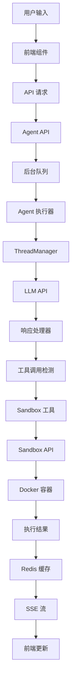

# Suna 与 Sandbox 交互系统深度分析

## 目录
1. [系统概述](#系统概述)
2. [架构设计](#架构设计)
3. [核心组件](#核心组件)
4. [交互流程](#交互流程)
5. [工具实现细节](#工具实现细节)
6. [安全机制](#安全机制)
7. [性能优化](#性能优化)
8. [最佳实践](#最佳实践)

## 系统概述

Suna 的 Sandbox 系统是一个基于 Docker 容器的安全代码执行环境，通过 Daytona SDK 进行管理，为 AI Agent 提供隔离的运行环境。该系统支持多种开发工具的执行，包括命令行、文件操作、浏览器自动化等。

### 关键特性
- **容器隔离**：每个项目独立的 Docker 容器环境
- **资源限制**：CPU、内存、磁盘配额管理
- **工具集成**：丰富的开发工具预装
- **实时交互**：通过 WebSocket/SSE 实现流式响应
- **安全控制**：多层权限验证和访问控制

## 架构设计

### 1. 分层架构

```
┌─────────────────────────────────────────────────────────┐
│                    前端应用层                            │
│  React Components | Hooks | API Client | WebSocket      │
├─────────────────────────────────────────────────────────┤
│                    API 网关层                            │
│  FastAPI Routes | Auth Middleware | Rate Limiting       │
├─────────────────────────────────────────────────────────┤
│                   Agent 执行层                           │
│  ThreadManager | ResponseProcessor | Tool Registry      │
├─────────────────────────────────────────────────────────┤
│                   工具抽象层                             │
│  SandboxToolsBase | Tool Implementations               │
├─────────────────────────────────────────────────────────┤
│                  Sandbox 管理层                          │
│  Daytona SDK | Container Lifecycle | Resource Manager   │
├─────────────────────────────────────────────────────────┤
│                   容器运行时                             │
│  Docker | noVNC | Chrome | Development Tools           │
└─────────────────────────────────────────────────────────┘
```

### 2. 数据流架构



## 核心组件

### 1. Sandbox 管理器 (`backend/sandbox/sandbox.py`)

负责容器的生命周期管理：

```python
class SandboxManager:
    async def create_sandbox(self, project_id: str, user_id: str):
        """创建新的 sandbox 容器"""
        config = DaytonaConfiguration(
            api_key={"apiKey": DAYTONA_API_KEY}
        )
        
        workspace_request = CreateWorkspaceRequest(
            id=workspace_id,
            name=workspace_name,
            target=DAYTONA_TARGET,
            repositories=[{
                "id": "suna",
                "url": "https://github.com/zuozuo/suna",
                "branch": "main"
            }],
            env_vars={
                "PROJECT_ID": project_id,
                "USER_ID": user_id,
                "WORKSPACE_DIR": "/workspace"
            }
        )
        
        return await workspaces_api.create_workspace(workspace_request)
```

### 2. 工具基类 (`backend/sandbox/tool_base.py`)

提供统一的工具接口：

```python
class SandboxToolsBase(Tool):
    def __init__(self, project_id: str, thread_manager=None):
        self.project_id = project_id
        self.thread_manager = thread_manager
        self.sandbox = None
        
    async def _ensure_sandbox(self):
        """确保 sandbox 已启动并可用"""
        project = await get_project(self.project_id)
        sandbox_id = project['sandbox']['id']
        self.sandbox = await get_or_start_sandbox(sandbox_id)
        
    async def _execute_in_sandbox(self, command: str):
        """在 sandbox 中执行命令"""
        await self._ensure_sandbox()
        return await self.sandbox.execute(command)
```

### 3. ThreadManager (`backend/agentpress/thread_manager.py`)

管理对话线程和工具调用：

```python
class ThreadManager:
    def __init__(self, trace=None, agent_config=None):
        self.tools = {}
        self.trace = trace
        self.agent_config = agent_config
        
    def add_tool(self, tool_class, **kwargs):
        """注册工具到线程管理器"""
        tool_instance = tool_class(**kwargs)
        self.tools[tool_instance.name] = tool_instance
        
    async def run_thread(self, thread_id, system_prompt, processor_config):
        """执行对话线程"""
        messages = await self.get_llm_messages(thread_id)
        
        # 调用 LLM
        llm_response = await self.llm_client.create_completion(
            messages=messages,
            tools=self.get_tool_schemas(),
            stream=True
        )
        
        # 处理响应流
        async for chunk in self.response_processor.process_streaming_response(
            llm_response=llm_response,
            thread_id=thread_id,
            config=processor_config
        ):
            yield chunk
```

## 交互流程

### 1. 完整的请求-响应流程

#### 步骤 1: 前端发起请求
```typescript
// frontend/src/hooks/useAgentStream.ts
const startAgent = async (runId: string) => {
    const response = await api.post(`/thread/${threadId}/agent/start`, {
        model_name: selectedModel,
        agent_config: agentConfig
    });
    
    // 开始监听 SSE 流
    const eventSource = new EventSource(
        `/api/agent-run/${response.agent_run_id}/stream`
    );
    
    eventSource.onmessage = handleStreamMessage;
};
```

#### 步骤 2: 后端创建 Agent Run
```python
# backend/agent/api.py
@router.post("/thread/{thread_id}/agent/start")
async def start_agent(thread_id: str, body: AgentStartRequest):
    # 验证权限
    await verify_thread_access(client, thread_id, user_id)
    
    # 创建 agent run 记录
    agent_run = await client.table('agent_runs').insert({
        "thread_id": thread_id,
        "status": "running",
        "model_name": body.model_name
    }).execute()
    
    # 发送到后台队列
    run_agent_background.send(
        agent_run_id=agent_run.data[0]['id'],
        thread_id=thread_id,
        project_id=project_id,
        agent_config=body.agent_config
    )
```

#### 步骤 3: 后台执行 Agent
```python
# backend/run_agent_background.py
@dramatiq.actor
async def run_agent_background(agent_run_id, thread_id, project_id, ...):
    # 初始化 Redis 键
    response_list_key = f"agent_run:{agent_run_id}:responses"
    response_channel = f"agent_run:{agent_run_id}:channel"
    
    # 执行 agent
    async for response in run_agent(thread_id, project_id, model_name, agent_config):
        # 存储响应到 Redis
        await redis.rpush(response_list_key, json.dumps(response))
        await redis.publish(response_channel, "new")
```

### 2. 工具调用流程

#### 步骤 1: LLM 返回工具调用
```xml
<function_calls>
<invoke name="SandboxShellTool">
<parameter name="command">npm install</parameter>
</invoke>
</function_calls>
```

#### 步骤 2: ResponseProcessor 解析工具调用
```python
# backend/agentpress/response_processor.py
def _parse_xml_tool_call(self, xml_content: str):
    root = ET.fromstring(xml_content)
    tool_name = root.find('.//invoke').get('name')
    
    parameters = {}
    for param in root.findall('.//parameter'):
        param_name = param.get('name')
        param_value = param.text
        parameters[param_name] = param_value
        
    return ToolCall(
        name=tool_name,
        parameters=parameters
    )
```

#### 步骤 3: 执行工具调用
```python
# backend/agentpress/response_processor.py
async def _execute_tool(self, tool_call: ToolCall):
    tool = self.thread_manager.tools.get(tool_call.name)
    if not tool:
        return {"error": f"Tool {tool_call.name} not found"}
        
    try:
        result = await tool.execute(**tool_call.parameters)
        return result
    except Exception as e:
        return {"error": str(e)}
```

## 工具实现细节

### 1. SandboxShellTool - 命令执行工具

提供在 sandbox 中执行 shell 命令的能力：

```python
class SandboxShellTool(SandboxToolsBase):
    name = "shell"
    description = "Execute shell commands in the sandbox"
    
    input_schema = {
        "type": "object",
        "properties": {
            "command": {
                "type": "string",
                "description": "The shell command to execute"
            },
            "wait_for_response": {
                "type": "boolean",
                "description": "Whether to wait for command completion",
                "default": True
            },
            "session_name": {
                "type": "string",
                "description": "Optional tmux session name"
            }
        },
        "required": ["command"]
    }
    
    async def execute_command(self, command: str, wait_for_response: bool = True, 
                            session_name: Optional[str] = None):
        await self._ensure_sandbox()
        
        # 创建或使用现有的 tmux 会话
        if session_name:
            await self._execute_raw_command(
                f"tmux has-session -t {session_name} 2>/dev/null || "
                f"tmux new-session -d -s {session_name}"
            )
        else:
            session_name = f"session_{uuid.uuid4().hex[:8]}"
            await self._execute_raw_command(
                f"tmux new-session -d -s {session_name}"
            )
        
        # 在 tmux 会话中执行命令
        escaped_command = command.replace('"', '\\"')
        await self._execute_raw_command(
            f'tmux send-keys -t {session_name} "{escaped_command}" Enter'
        )
        
        if wait_for_response:
            # 等待命令完成并获取输出
            output = await self._wait_for_completion(session_name)
            return self.success_response({
                "output": output,
                "session_name": session_name
            })
        else:
            return self.success_response({
                "message": "Command started",
                "session_name": session_name
            })
```

### 2. SandboxFilesTool - 文件操作工具

管理 sandbox 中的文件系统操作：

```python
class SandboxFilesTool(SandboxToolsBase):
    name = "file"
    description = "Manage files in the sandbox"
    
    input_schema = {
        "type": "object",
        "properties": {
            "command": {
                "type": "string",
                "enum": ["create", "str_replace", "view", "delete"],
                "description": "The file operation to perform"
            },
            "path": {
                "type": "string",
                "description": "The file path"
            },
            "file_text": {
                "type": "string",
                "description": "Content for create operation"
            },
            "old_str": {
                "type": "string",
                "description": "String to replace"
            },
            "new_str": {
                "type": "string",
                "description": "Replacement string"
            }
        },
        "required": ["command", "path"]
    }
    
    async def str_replace(self, path: str, old_str: str, new_str: str):
        """替换文件中的字符串"""
        await self._ensure_sandbox()
        
        # 读取文件内容
        file_content = await self._read_file(path)
        
        # 检查要替换的字符串是否唯一
        occurrences = file_content.count(old_str)
        if occurrences == 0:
            return self.error_response(f"String '{old_str}' not found")
        elif occurrences > 1:
            return self.error_response(
                f"String '{old_str}' found {occurrences} times, "
                "please provide a unique string"
            )
        
        # 执行替换
        new_content = file_content.replace(old_str, new_str)
        await self._write_file(path, new_content)
        
        # 如果是 index.html，提供预览链接
        if path.endswith('index.html'):
            preview_url = await self._get_preview_url(path)
            return self.success_response({
                "message": "File updated successfully",
                "preview_url": preview_url
            })
        
        return self.success_response({"message": "File updated successfully"})
```

### 3. SandboxBrowserTool - 浏览器自动化工具

控制 sandbox 中的 Chrome 浏览器：

```python
class SandboxBrowserTool(SandboxToolsBase):
    name = "browser"
    description = "Control a Chrome browser instance"
    
    input_schema = {
        "type": "object",
        "properties": {
            "action": {
                "type": "string",
                "enum": ["open", "click", "type", "scroll", "screenshot"],
                "description": "The browser action to perform"
            },
            "selector": {
                "type": "string",
                "description": "CSS selector for the element"
            },
            "text": {
                "type": "string",
                "description": "Text to type"
            },
            "url": {
                "type": "string",
                "description": "URL to navigate to"
            }
        },
        "required": ["action"]
    }
    
    async def screenshot(self):
        """截取当前页面的屏幕截图"""
        await self._ensure_sandbox()
        
        # 调用浏览器自动化 API
        screenshot_response = await self._browser_api_request(
            "screenshot",
            method="POST"
        )
        
        if screenshot_response["success"]:
            # 获取 base64 编码的图像
            base64_image = screenshot_response["data"]["screenshot"]
            
            # 验证图像格式
            if not self._is_valid_base64_image(base64_image):
                return self.error_response("Invalid screenshot data")
            
            # 上传到 S3
            image_url = await self._upload_screenshot(base64_image)
            
            # 保存截图消息到线程
            if self.thread_manager:
                await self.thread_manager.add_message(
                    role="tool",
                    content=json.dumps({
                        "tool_name": "browser",
                        "action": "screenshot",
                        "result": {
                            "image_url": image_url,
                            "timestamp": datetime.utcnow().isoformat()
                        }
                    }),
                    message_type="browser_state"
                )
            
            return self.success_response({
                "screenshot_url": image_url
            })
```

### 4. SandboxVisionTool - 图像处理工具

处理和分析图像：

```python
class SandboxVisionTool(SandboxToolsBase):
    name = "vision"
    description = "Process and analyze images"
    
    MAX_IMAGE_SIZE = (1920, 1080)
    JPEG_QUALITY = 85
    PNG_COMPRESS_LEVEL = 6
    
    async def process_image(self, image_path: str, prompt: str):
        """处理本地图像文件"""
        await self._ensure_sandbox()
        
        # 读取图像
        image_data = await self._read_file(image_path, binary=True)
        
        # 压缩和优化图像
        optimized_image = await self._optimize_image(image_data)
        
        # 转换为 base64
        base64_image = base64.b64encode(optimized_image).decode('utf-8')
        
        # 调用视觉 API
        response = await self._vision_api_request({
            "image": base64_image,
            "prompt": prompt
        })
        
        return self.success_response(response)
    
    async def _optimize_image(self, image_data: bytes) -> bytes:
        """优化图像大小和格式"""
        image = Image.open(io.BytesIO(image_data))
        
        # 调整大小
        if image.size > self.MAX_IMAGE_SIZE:
            image.thumbnail(self.MAX_IMAGE_SIZE, Image.Resampling.LANCZOS)
        
        # 转换 RGBA 到 RGB
        if image.mode == 'RGBA':
            background = Image.new('RGB', image.size, (255, 255, 255))
            background.paste(image, mask=image.split()[3])
            image = background
        
        # 保存优化后的图像
        output = io.BytesIO()
        if image.format == 'PNG':
            image.save(output, format='PNG', compress_level=self.PNG_COMPRESS_LEVEL)
        else:
            image.save(output, format='JPEG', quality=self.JPEG_QUALITY)
        
        return output.getvalue()
```

### 5. SandboxExposeTool - 端口暴露工具

暴露 sandbox 中的服务到公网：

```python
class SandboxExposeTool(SandboxToolsBase):
    name = "expose"
    description = "Expose a local port to the internet"
    
    async def expose_port(self, port: int):
        """暴露指定端口到公网"""
        await self._ensure_sandbox()
        
        # 等待 supervisord 服务就绪
        await self._wait_for_service_ready()
        
        # 检查端口是否有服务在监听
        port_check = await self._execute_raw_command(
            f"netstat -tln | grep ':{port}'"
        )
        
        if not port_check.strip():
            return self.error_response(
                f"No service listening on port {port}"
            )
        
        # 获取暴露的 URL
        expose_url = await self._get_expose_url(port)
        
        return self.success_response({
            "url": expose_url,
            "port": port,
            "message": f"Port {port} is now accessible at {expose_url}"
        })
```

### 6. SandboxDeployTool - 部署工具

部署应用到 Cloudflare Workers：

```python
class SandboxDeployTool(SandboxToolsBase):
    name = "deploy"
    description = "Deploy applications to Cloudflare Workers"
    
    async def deploy_cloudflare(self, name: str, directory: str = "."):
        """部署到 Cloudflare Workers"""
        await self._ensure_sandbox()
        
        # 生成唯一的项目名称
        project_name = f"{self.sandbox.id}-{name}"
        
        # 创建 wrangler.toml 配置
        wrangler_config = f"""
name = "{project_name}"
main = "src/index.js"
compatibility_date = "2023-12-01"

[env.production]
route = "https://{project_name}.workers.dev/*"
"""
        
        await self._write_file(
            f"{directory}/wrangler.toml",
            wrangler_config
        )
        
        # 执行部署
        deploy_result = await self._execute_raw_command(
            f"cd {directory} && wrangler publish",
            env={"CLOUDFLARE_API_TOKEN": self.cloudflare_token}
        )
        
        # 提取部署 URL
        deploy_url = self._extract_deploy_url(deploy_result)
        
        return self.success_response({
            "url": deploy_url,
            "project_name": project_name,
            "message": f"Successfully deployed to {deploy_url}"
        })
```

## 安全机制

### 1. 容器级隔离

- **资源限制**：
  ```yaml
  resources:
    limits:
      cpu: "2"
      memory: "4Gi"
      storage: "5Gi"
  ```

- **网络隔离**：每个容器有独立的网络命名空间

- **文件系统隔离**：只能访问 `/workspace` 目录

### 2. API 级权限控制

```python
async def verify_sandbox_access(project_id: str, user_id: str):
    """验证用户对 sandbox 的访问权限"""
    # 检查项目所有权
    project = await get_project(project_id)
    if project['account_id'] != user_id:
        # 检查是否是团队成员
        is_member = await check_team_membership(
            project['account_id'], 
            user_id
        )
        if not is_member:
            raise PermissionError("Access denied")
```

### 3. 命令注入防护

```python
def escape_shell_command(command: str) -> str:
    """转义 shell 命令中的特殊字符"""
    # 使用 shlex.quote 进行安全的命令转义
    return shlex.quote(command)
```

### 4. 路径遍历防护

```python
def normalize_path(path: str, base_dir: str = "/workspace") -> str:
    """规范化路径，防止目录遍历攻击"""
    # 获取绝对路径
    abs_path = os.path.abspath(os.path.join(base_dir, path))
    
    # 确保路径在允许的目录内
    if not abs_path.startswith(base_dir):
        raise ValueError("Path traversal detected")
    
    return abs_path
```

## 性能优化

### 1. 连接池管理

```python
class SandboxConnectionPool:
    def __init__(self, max_connections: int = 10):
        self.pool = asyncio.Queue(maxsize=max_connections)
        self.semaphore = asyncio.Semaphore(max_connections)
    
    async def get_connection(self, sandbox_id: str):
        async with self.semaphore:
            # 复用现有连接或创建新连接
            if not self.pool.empty():
                return await self.pool.get()
            else:
                return await create_new_connection(sandbox_id)
```

### 2. 缓存策略

```python
@functools.lru_cache(maxsize=128)
async def get_sandbox_info(sandbox_id: str):
    """缓存 sandbox 信息，减少 API 调用"""
    return await fetch_sandbox_info(sandbox_id)
```

### 3. 批量操作优化

```python
async def batch_file_operations(operations: List[FileOperation]):
    """批量执行文件操作，减少网络往返"""
    batch_request = {
        "operations": [op.to_dict() for op in operations]
    }
    return await sandbox_api.batch_execute(batch_request)
```

## 最佳实践

### 1. 工具开发指南

1. **继承基类**：所有 sandbox 工具都应继承 `SandboxToolsBase`
2. **错误处理**：使用统一的 `success_response` 和 `error_response`
3. **异步执行**：所有 I/O 操作使用 `async/await`
4. **状态管理**：通过 `thread_manager` 保存工具状态

### 2. 性能建议

1. **批量操作**：尽可能批量执行相关操作
2. **连接复用**：复用 sandbox 连接，避免频繁创建
3. **异步并发**：利用 asyncio 并发执行独立任务
4. **缓存结果**：缓存不常变化的数据

### 3. 安全建议

1. **输入验证**：严格验证所有用户输入
2. **最小权限**：只授予必要的权限
3. **审计日志**：记录所有敏感操作
4. **定期更新**：及时更新依赖和安全补丁

### 4. 调试技巧

1. **日志记录**：
   ```python
   logger.debug(f"Executing command in sandbox {sandbox_id}: {command}")
   ```

2. **性能监控**：
   ```python
   async with trace.span("sandbox_operation"):
       result = await execute_operation()
   ```

3. **错误上下文**：
   ```python
   try:
       result = await risky_operation()
   except Exception as e:
       logger.error(f"Operation failed: {e}", exc_info=True)
       raise SandboxError(f"Failed to execute: {str(e)}")
   ```

## 总结

Suna 的 Sandbox 系统提供了一个功能完整、安全可靠的代码执行环境。通过容器隔离、权限控制和丰富的工具集成，为 AI Agent 提供了强大的开发能力。系统的设计考虑了安全性、性能和可扩展性，能够满足各种开发场景的需求。