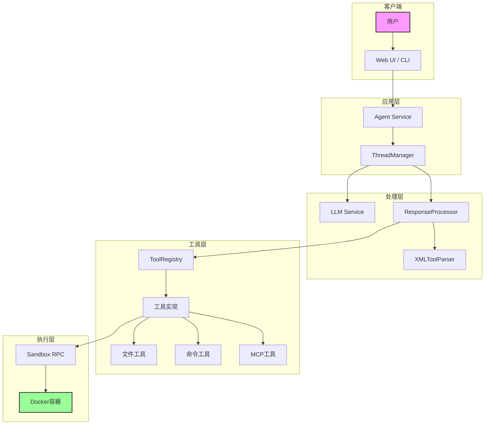
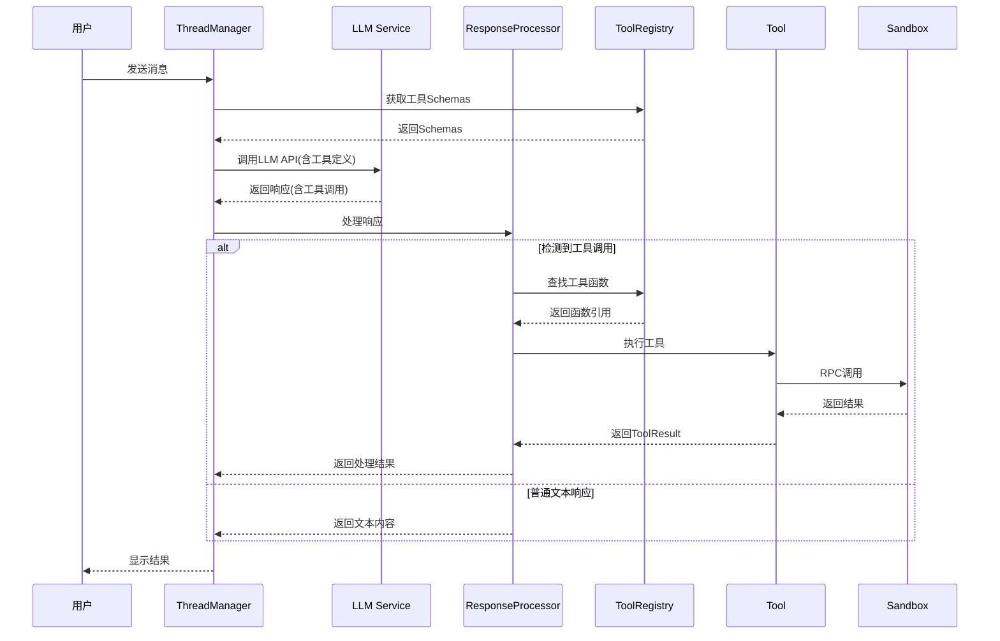
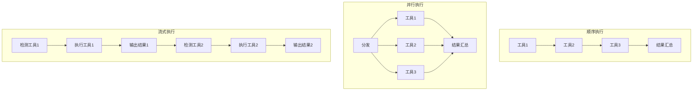
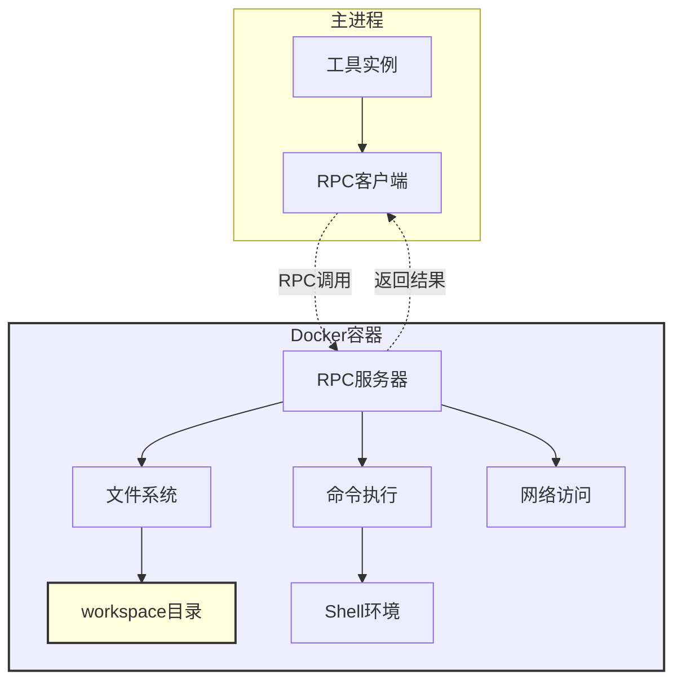
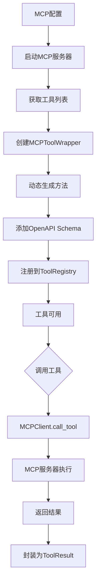
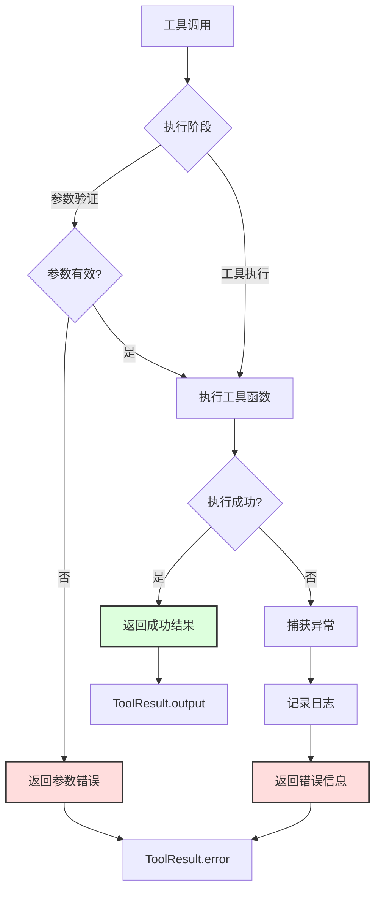
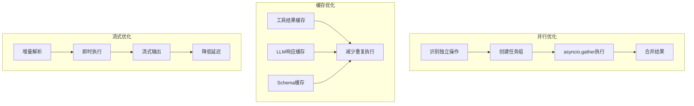

# Suna 工具系统完整指南

本文档全面介绍 Suna 的工具系统，包括工具列表、架构设计、使用方法和扩展指南。

## 📋 工具列表概览

Suna 系统包含 **12 个核心工具**，分为以下几类：

### 🖥️ 系统与文件操作
| 工具名称 | 定义文件 | 功能描述 |
|---------|---------|---------|
| **SandboxShellTool** | `sb_shell_tool.py` | 执行命令行命令，支持 tmux 会话管理 |
| **SandboxFilesTool** | `sb_files_tool.py` | 文件增删改查、目录操作 |

### 🌐 Web 相关
| 工具名称 | 定义文件 | 功能描述 |
|---------|---------|---------|
| **SandboxBrowserTool** | `sb_browser_tool.py` | 浏览器自动化（截图、点击、输入等） |
| **SandboxWebSearchTool** | `web_search_tool.py` | 使用 Tavily API 进行网络搜索 |
| **SandboxDeployTool** | `sb_deploy_tool.py` | 部署应用到 Vercel |

### 👁️ 视觉与展示
| 工具名称 | 定义文件 | 功能描述 |
|---------|---------|---------|
| **SandboxVisionTool** | `sb_vision_tool.py` | 截屏和图像查看 |
| **SandboxExposeTool** | `sb_expose_tool.py` | 暴露本地端口到公网 |

### 💬 消息与通信
| 工具名称 | 定义文件 | 功能描述 |
|---------|---------|---------|
| **MessageTool** | `message_tool.py` | 发送格式化消息给用户 |
| **ExpandMessageTool** | `expand_msg_tool.py` | 扩展消息长度限制 |

### 🔌 扩展与集成
| 工具名称 | 定义文件 | 功能描述 |
|---------|---------|---------|
| **DataProvidersTool** | `data_providers_tool.py` | 访问多种数据源（LinkedIn、Twitter等） |
| **UpdateAgentTool** | `update_agent_tool.py` | 动态更新 Agent 配置 |
| **MCPToolWrapper** | `mcp_tool_wrapper.py` | 动态加载 MCP 协议工具 |

## 🏗️ 工具系统架构

### 1. 整体架构图



### 2. 工具基类定义

**文件**: `backend/agentpress/tool.py`

```python
class Tool:
    """所有工具的抽象基类"""
    
    def definition(self) -> dict:
        """返回工具定义（OpenAPI 格式）"""
        pass
    
    def xml_definition(self) -> dict:
        """返回 XML 格式的工具定义"""
        pass
    
    def execute(self, context: Any) -> dict:
        """执行工具的抽象方法"""
        raise NotImplementedError
```

### 3. 沙箱工具基类

**文件**: `backend/sandbox/tool_base.py`

```python
class SandboxToolsBase(Tool):
    """沙箱环境中工具的基类"""
    
    def __init__(self, sandbox, thread_id, user_id):
        self.sandbox = sandbox
        self.thread_id = thread_id
        self.user_id = user_id
        self.api_url = sandbox.api_url
```

### 4. 工具注册机制

**文件**: `backend/agentpress/tool_registry.py`

```python
class ToolRegistry:
    """工具注册中心"""
    
    def __init__(self):
        self._tools: Dict[str, Tool] = {}
    
    def register_tool(self, tool: Tool):
        """注册工具到系统"""
        for method_name in tool.get_methods():
            self._tools[method_name] = tool
    
    def get_tool(self, tool_name: str) -> Optional[Tool]:
        """获取工具实例"""
        return self._tools.get(tool_name)
```

## 🔧 工具定义方式

### 1. 使用装饰器定义

```python
class SandboxFilesTool(SandboxToolsBase):
    
    @method()
    @argument("path", str, "文件路径", required=True)
    @argument("content", str, "文件内容", required=True)
    def write(self, path: str, content: str) -> dict:
        """写入文件"""
        # 实现逻辑
        pass
```

### 2. Schema 生成

工具会自动生成两种格式的 Schema：

**OpenAPI 格式**:
```json
{
    "title": "write",
    "type": "object",
    "properties": {
        "path": {"type": "string", "description": "文件路径"},
        "content": {"type": "string", "description": "文件内容"}
    },
    "required": ["path", "content"]
}
```

**XML 格式**:
```xml
<write>
    <path>文件路径</path>
    <content>文件内容</content>
</write>
```

## 🚀 工具执行流程

### 1. LLM 调用流程图



### 2. 工具执行模式对比



## 📦 具体工具实现示例

### SandboxBrowserTool - 浏览器自动化

```python
class SandboxBrowserTool(SandboxToolsBase):
    
    @method()
    @argument("url", str, "要访问的URL", required=True)
    def navigate(self, url: str) -> dict:
        """导航到指定URL"""
        response = requests.post(
            f"{self.api_url}/browser/navigate",
            json={"url": url}
        )
        return {"status": "success", "url": url}
    
    @method()
    @argument("selector", str, "CSS选择器", required=True)
    def click(self, selector: str) -> dict:
        """点击页面元素"""
        response = requests.post(
            f"{self.api_url}/browser/click",
            json={"selector": selector}
        )
        return {"status": "clicked", "selector": selector}
```

## 🎨 前端工具展示

### 工具调用的 UI 组件

**文件路径**: `frontend/src/components/thread/tool-views/`

每个工具都有对应的视图组件：
- `BrowserToolView.tsx` - 浏览器操作展示
- `FileOperationToolView.tsx` - 文件操作展示
- `CommandToolView.tsx` - 命令执行展示
- `WebSearchToolView.tsx` - 搜索结果展示

### 工具结果解析

**文件**: `frontend/src/components/thread/tool-views/tool-result-parser.ts`

```typescript
export function parseToolResult(toolName: string, result: any) {
    switch (toolName) {
        case 'navigate':
            return <BrowserView url={result.url} />;
        case 'write':
            return <FileView path={result.path} />;
        // ... 其他工具
    }
}
```

## 🔒 安全机制

### 1. 沙盒执行架构



### 2. 安全措施

1. **沙箱隔离**
   - 所有工具在 Daytona 沙箱中执行
   - 限制文件系统访问范围
   - 网络访问控制

2. **权限验证**
   - 每个工具调用都验证用户权限
   - 基于项目的访问控制
   - API 密钥验证

3. **输入验证**
   - 参数类型检查
   - 路径遍历防护
   - 命令注入防护

## 🛠️ 扩展新工具

### 1. 创建工具类

```python
# backend/agent/tools/my_custom_tool.py
from sandbox.tool_base import SandboxToolsBase
from agentpress.tool import method, argument

class MyCustomTool(SandboxToolsBase):
    
    @method()
    @argument("param1", str, "参数说明", required=True)
    def my_method(self, param1: str) -> dict:
        # 实现逻辑
        return {"result": "success"}
```

### 2. 注册工具

```python
# 在工具加载时注册
def register_tools(thread_manager, sandbox):
    tools = [
        MyCustomTool(sandbox, thread_id, user_id),
        # 其他工具...
    ]
    
    for tool in tools:
        thread_manager.tool_registry.register_tool(tool)
```

### 3. 创建前端视图

```typescript
// frontend/src/components/thread/tool-views/MyCustomToolView.tsx
export function MyCustomToolView({ result }: { result: any }) {
    return (
        <div className="tool-result">
            <h3>My Custom Tool Result</h3>
            <pre>{JSON.stringify(result, null, 2)}</pre>
        </div>
    );
}
```

## 🔄 MCP 工具集成

MCP (Model Context Protocol) 允许动态加载第三方工具：

### 1. MCP 工具集成流程



### 2. 配置示例

```json
{
  "mcpServers": {
    "filesystem": {
      "command": "npx",
      "args": ["@modelcontextprotocol/server-filesystem"]
    }
  }
}
```

## 📊 工具使用统计

系统会跟踪工具使用情况：
- 调用次数
- 执行时间
- 成功/失败率
- 资源消耗

这些数据可用于：
- 优化性能
- 改进工具设计
- 使用量计费

## 🎯 最佳实践

### 1. 错误处理流程



### 2. 性能优化策略



### 3. 开发建议

1. **错误处理**
   - 总是返回结构化的错误信息
   - 提供有用的错误描述
   - 记录详细的错误日志

2. **性能优化**
   - 使用流式处理大文件
   - 实现结果缓存
   - 避免阻塞操作

3. **用户体验**
   - 提供清晰的进度反馈
   - 支持操作取消
   - 返回易于理解的结果

## 相关文档

- [工具系统架构详解](./tool-system-architecture.md) - 深入了解架构设计
- [工具调用 API 示例](./tool-calling-api-examples.md) - 具体的 API 使用示例
- [双模态调用系统](./dual-mode-tool-calling-system-analysis.md) - OpenAI 和 Anthropic 格式支持
- [沙盒工具指南](./sandboxshelltool-guide.md) - 安全执行环境详解
- [Daytona tmux 集成](./daytona-tmux-integration.md) - Daytona 与 tmux 的集成方案

通过这个强大的工具系统，Suna 能够执行各种复杂的任务，从简单的文件操作到复杂的网页自动化，为用户提供真正的 AI 助手体验。