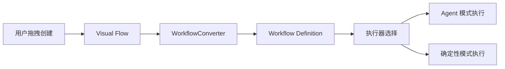

# Suna Workflow 系统深度分析

## 概述

本文档基于对 Suna Workflow 系统源代码的深入分析，详细介绍了该系统的工作机制、架构设计、实现细节以及解决的核心问题。

## 1. 系统架构

### 1.1 三层架构设计

```
┌─────────────────────────────────────────────────────────┐
│                    前端层 (Frontend)                      │
│         React + TypeScript + ReactFlow + Zustand         │
│                  可视化编辑器 + 状态管理                   │
└─────────────────────────────────────────────────────────┘
                            ↕ API
┌─────────────────────────────────────────────────────────┐
│                    后端层 (Backend)                       │
│              Python + FastAPI + Dramatiq                 │
│          API服务 + 转换器 + 执行器 + 调度器               │
└─────────────────────────────────────────────────────────┘
                            ↕ SQL
┌─────────────────────────────────────────────────────────┐
│                    数据层 (Database)                      │
│                PostgreSQL + Supabase                     │
│         工作流定义 + 执行记录 + 触发器 + 日志             │
└─────────────────────────────────────────────────────────┘
```

### 1.2 核心模块

- **WorkflowBuilder**：可视化工作流编辑器
- **WorkflowConverter**：可视化流程到执行定义的转换器
- **WorkflowExecutor**：传统 Agent 模式执行器
- **DeterministicWorkflowExecutor**：确定性模式执行器
- **WorkflowScheduler**：定时任务调度器

## 2. 核心工作机制

### 2.1 双重数据结构

系统采用了创新的双重数据结构设计：

```typescript
// 可视化表示（存储在 workflow_flows 表）
interface VisualFlow {
  nodes: WorkflowNode[]  // 可视化节点
  edges: WorkflowEdge[]  // 节点连接
}

// 执行定义（通过转换生成）
interface WorkflowDefinition {
  steps: WorkflowStep[]     // 执行步骤
  triggers: WorkflowTrigger[] // 触发器配置
}
```

### 2.2 数据流转过程



### 2.3 转换机制详解

`WorkflowConverter` 是系统的核心组件，负责将可视化流程转换为可执行定义：

```python
def convert_flow_to_workflow(self, nodes, edges, metadata):
    # 1. 提取输入配置
    input_config = self._extract_input_configuration(nodes)
    
    # 2. 生成工作流提示词
    workflow_prompt = self._generate_workflow_prompt(nodes, edges, input_config)
    
    # 3. 提取触发器
    triggers = self._extract_triggers_from_input(input_config)
    
    # 4. 提取工具配置
    enabled_tools = []
    for tool_node in tool_nodes:
        enabled_tools.append({
            "id": tool_id,
            "name": tool_name,
            "instructions": instructions
        })
    
    # 5. 提取 MCP 配置
    mcp_configs = self._extract_mcp_configurations(mcp_nodes)
    
    # 6. 生成执行步骤
    return WorkflowDefinition(...)
```

## 3. 执行模式分析

### 3.1 传统 Agent 模式

- **特点**：将整个工作流转换为单个 Agent 任务
- **优势**：灵活，能处理复杂推理
- **劣势**：执行路径可能偏离预期

### 3.2 确定性模式（当前实现）

通过代码分析发现，当前的"确定性执行器"实际上仍然使用 AI Agent：

```python
# deterministic_executor.py
async for response in run_agent(
    thread_id=thread_id,
    agent_config=agent_config,  # 从可视化流程生成的结构化配置
    max_iterations=10
):
    # 处理响应...
```

**关键发现**：确定性模式通过更结构化的提示词和配置来约束 AI 行为，而非真正的图执行引擎。

## 4. 核心功能实现

### 4.1 节点类型

1. **输入节点（InputNode）**
   - 定义工作流入口
   - 配置触发方式
   - 设置初始提示词

2. **Agent节点（AgentNode）**
   - AI 智能执行单元
   - 支持多模型选择
   - 可配置执行参数

3. **工具节点（ToolConnectionNode）**
   - 连接内置工具
   - 自定义工具说明
   - 参数配置

4. **MCP节点（MCPNode）**
   - 连接 MCP 服务器
   - 支持 Smithery 和自定义 MCP
   - 工具选择和配置

### 4.2 触发机制

```python
# 支持的触发器类型
class TriggerType(Enum):
    MANUAL = "MANUAL"          # 手动触发
    SCHEDULE = "SCHEDULE"      # 定时触发
    WEBHOOK = "WEBHOOK"        # Webhook 触发
    EVENT = "EVENT"           # 事件触发
```

### 4.3 工具集成

系统通过多种方式集成工具：

1. **内置工具**：文件操作、Web搜索、浏览器自动化等
2. **MCP 协议**：支持任意 MCP 服务器
3. **自定义工具**：通过 API 扩展

## 5. 解决的核心问题

### 5.1 AI 自动化的可控性问题

**问题**：纯 AI Agent 执行不可预测
**解决**：通过可视化流程约束执行路径

### 5.2 复杂流程构建难题

**问题**：代码构建工作流门槛高
**解决**：拖拽式可视化编辑器

### 5.3 系统集成复杂性

**问题**：不同系统集成需要大量代码
**解决**：内置工具库 + MCP 扩展机制

### 5.4 触发方式单一

**问题**：不同场景需要不同触发方式
**解决**：支持手动、定时、Webhook、事件等多种触发器

## 6. 典型使用场景

### 6.1 数据处理管道
```yaml
触发器: 每日凌晨2点
流程:
  1. API 数据采集
  2. AI 数据清洗
  3. 质量检查
  4. 数据入库
  5. 报告生成
```

### 6.2 智能客服系统
```yaml
触发器: Slack/Telegram 消息
流程:
  1. 接收消息
  2. 意图分析
  3. 路由分支
  4. 生成回复
  5. 发送响应
```

### 6.3 内容创作发布
```yaml
触发器: 每周一三五
流程:
  1. 素材收集
  2. AI 创作
  3. 人工审核
  4. 多平台发布
  5. 效果追踪
```

## 7. 技术亮点

### 7.1 前后端解耦
- 清晰的 API 定义
- TypeScript 类型安全
- 独立的状态管理

### 7.2 流式执行
- SSE 实时状态更新
- 渐进式结果返回
- 良好的用户体验

### 7.3 安全隔离
- 项目级沙箱环境
- 资源访问控制
- 执行超时管理

### 7.4 扩展性设计
- 插件式节点系统
- 灵活的执行器架构
- 开放的集成接口

## 8. 对比分析

### 8.1 vs 传统工作流引擎

| 特性 | Suna Workflow | Apache Airflow |
|-----|--------------|----------------|
| 设计方式 | 可视化拖拽 | Python 代码 |
| AI 集成 | 原生支持 | 需要扩展 |
| 学习曲线 | 低 | 高 |
| 适用场景 | AI 驱动自动化 | 数据管道 |

### 8.2 vs 纯 AI Agent

| 特性 | Suna Workflow | 纯 AI Agent |
|-----|--------------|-------------|
| 可控性 | 高（流程约束） | 低（依赖提示词） |
| 复杂逻辑 | 可视化表达 | 自然语言描述 |
| 调试能力 | 节点级追踪 | 黑盒调试 |
| 可重复性 | 相对稳定 | 结果多变 |

## 9. 未来改进方向

### 9.1 真正的确定性执行
实现基于图的执行引擎，支持：
- 精确的流程控制
- 条件分支执行
- 循环结构
- 并行处理

### 9.2 增强调试能力
- 节点断点
- 变量监视
- 执行回放
- 错误定位

### 9.3 版本管理
- 工作流版本控制
- 变更历史
- 回滚机制
- A/B 测试

### 9.4 性能优化
- 并行执行优化
- 结果缓存
- 资源调度
- 负载均衡

## 10. 总结

Suna Workflow 系统通过创新的"可视化编辑 + AI 执行"模式，成功解决了 AI 时代自动化面临的核心挑战。系统设计精良，架构清晰，具有良好的可扩展性和用户体验。

虽然当前的"确定性执行"仍依赖 AI Agent，但通过结构化的提示词生成和执行约束，已经在很大程度上提升了执行的可控性。这种设计既保留了 AI 的智能处理能力，又提供了传统工作流的可预测性，为企业级 AI 自动化提供了一个优秀的解决方案。

系统特别适合那些需要结合人工智能和确定性流程的复杂业务场景，如数据处理、内容生成、系统集成等领域。随着功能的不断完善，Suna Workflow 有望成为 AI 时代的重要自动化基础设施。