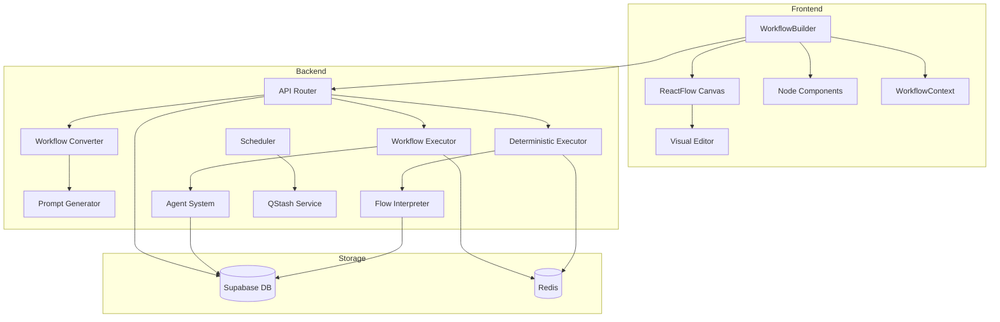
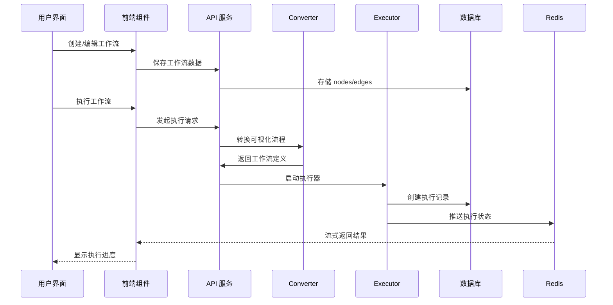

# Suna Workflow 系统架构深度分析

## 1. 系统概述

Suna Workflow 系统是一个可视化的工作流编排和执行平台，支持用户通过拖拽方式创建复杂的自动化工作流。系统采用前后端分离架构，提供了两种执行模式：传统的代理执行模式和基于可视化流程的确定性执行模式。

## 2. 系统架构

### 2.1 技术栈

- **前端**: React + TypeScript + ReactFlow
- **后端**: Python + FastAPI + AsyncIO
- **数据库**: Supabase (PostgreSQL)
- **消息队列**: Redis (用于流式响应)
- **调度器**: QStash (云端调度服务)
- **执行环境**: Docker Sandbox

### 2.2 核心模块



## 3. 工作流程详细分析

### 3.1 工作流创建流程

1. **用户界面交互**
   - 用户在 WorkflowBuilder 组件中拖拽节点
   - 节点类型：InputNode、AgentNode、ToolConnectionNode、MCPNode
   - 通过连线建立节点间关系

2. **数据结构转换**
   ```typescript
   // 前端节点数据结构
   interface WorkflowNode {
     id: string;
     type: string;
     position: { x: number; y: number };
     data: {
       label: string;
       nodeId: string;
       // 其他配置...
     };
   }
   
   // 前端边数据结构
   interface WorkflowEdge {
     id: string;
     source: string;
     target: string;
     sourceHandle?: string;
     targetHandle?: string;
   }
   ```

3. **保存流程**
   - 自动保存：检测变化后 2 秒延迟保存
   - 手动保存：用户点击保存按钮
   - 数据存储：workflow_flows 表存储可视化数据，workflows 表存储定义

### 3.2 工作流执行流程

#### 3.2.1 传统执行模式 (WorkflowExecutor)

```python
# 执行流程
1. 加载工作流定义
2. 提取工具和 MCP 配置
3. 构建系统提示词
4. 创建执行线程
5. 调用 Agent 系统执行
6. 流式返回结果
```

**特点**：
- 将整个工作流转换为单个 Agent 任务
- 依赖 Agent 的智能理解和执行
- 灵活但可能偏离预期流程

#### 3.2.2 确定性执行模式 (DeterministicWorkflowExecutor)

```python
# 执行流程
1. 加载工作流和可视化数据
2. 构建执行图
3. 识别入口点和循环
4. 按照拓扑顺序执行节点
5. 处理节点间数据传递
6. 支持循环和条件分支
```

**特点**：
- 严格按照可视化流程执行
- 支持复杂的流程控制（循环、条件）
- 更可预测和可控

### 3.3 数据流向



## 4. 架构特点分析

### 4.1 前后端协作

1. **数据同步机制**
   - 前端维护可视化表示 (nodes/edges)
   - 后端转换为可执行定义 (WorkflowDefinition)
   - 双向数据绑定确保一致性

2. **实时通信**
   - WebSocket/SSE 用于执行状态推送
   - Redis 作为消息中间件
   - 支持断线重连和状态恢复

### 4.2 可视化与执行逻辑分离

1. **分层设计**
   - 表现层：ReactFlow 可视化编辑器
   - 转换层：WorkflowConverter 处理映射
   - 执行层：独立的执行器实现

2. **优势**
   - 可视化组件可独立升级
   - 执行逻辑可灵活切换
   - 支持多种执行策略

### 4.3 双执行模式差异

| 特性 | 传统模式 | 确定性模式 |
|------|---------|-----------|
| 执行方式 | Agent 自主决策 | 严格按流程 |
| 灵活性 | 高 | 中 |
| 可预测性 | 低 | 高 |
| 错误处理 | Agent 自动处理 | 需预定义 |
| 性能 | 单次 Agent 调用 | 多次节点执行 |
| 适用场景 | 探索性任务 | 标准化流程 |

### 4.4 扩展性设计

1. **节点类型扩展**
   ```typescript
   // 新增节点类型只需：
   1. 前端：创建新的节点组件
   2. 后端：添加节点处理逻辑
   3. 转换器：更新转换规则
   ```

2. **执行器扩展**
   - 执行器接口统一
   - 支持插件式执行器
   - 可添加新的执行策略

3. **触发器扩展**
   - 支持多种触发方式（手动、定时、Webhook）
   - 触发器配置独立
   - 易于添加新触发类型

## 5. 关键实现细节

### 5.1 工具和 MCP 集成

```python
# 工具提取流程
1. 从可视化节点提取工具配置
2. 从工作流步骤提取工具列表
3. 合并去重
4. 加载凭证配置
5. 构建最终工具集
```

### 5.2 循环检测和处理

```python
# DeterministicWorkflowExecutor 中的循环处理
1. DFS 检测循环结构
2. 标记循环入口和出口
3. 维护循环状态
4. 支持最大迭代限制
5. 动态退出条件检查
```

### 5.3 错误处理机制

1. **节点级错误**
   - 捕获执行异常
   - 记录错误状态
   - 支持错误处理节点

2. **工作流级错误**
   - 超时保护
   - 资源限制
   - 优雅降级

### 5.4 状态管理

```typescript
// 前端状态管理
- React State: 组件局部状态
- WorkflowContext: 工作流全局状态  
- Auto-save: 变更检测和自动保存

// 后端状态管理
- 数据库: 持久化状态
- Redis: 执行时状态
- 内存: 临时计算状态
```

## 6. 性能优化

1. **前端优化**
   - 虚拟化大型画布
   - 防抖自动保存
   - 懒加载节点组件

2. **后端优化**
   - 异步执行
   - 连接池复用
   - 结果缓存

3. **数据传输优化**
   - 增量更新
   - 压缩传输
   - 流式响应

## 7. 安全性考虑

1. **访问控制**
   - JWT 认证
   - 项目级隔离
   - 用户权限检查

2. **执行隔离**
   - Docker 沙箱环境
   - 资源限制
   - 网络隔离

3. **数据安全**
   - 凭证加密存储
   - 传输加密
   - 审计日志

## 8. 未来改进方向

1. **功能增强**
   - 支持更多节点类型（条件、并行、子流程）
   - 版本控制和回滚
   - 工作流模板市场

2. **性能提升**
   - 分布式执行
   - 缓存优化
   - 预编译优化

3. **用户体验**
   - 可视化调试器
   - 实时协作编辑
   - 更丰富的节点库

## 9. 总结

Suna Workflow 系统通过创新的双执行模式设计，既保留了 AI Agent 的灵活性，又提供了确定性执行的可控性。前后端分离的架构确保了系统的可维护性和扩展性，而可视化编辑器大大降低了用户创建复杂工作流的门槛。整体架构设计合理，具有良好的扩展性和性能表现。