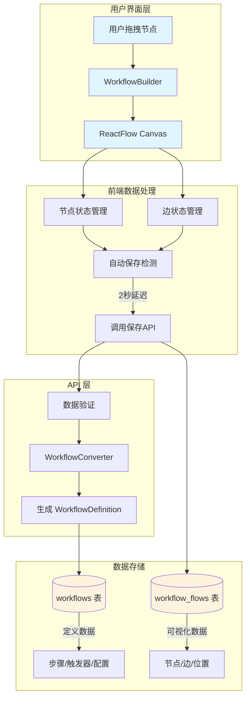
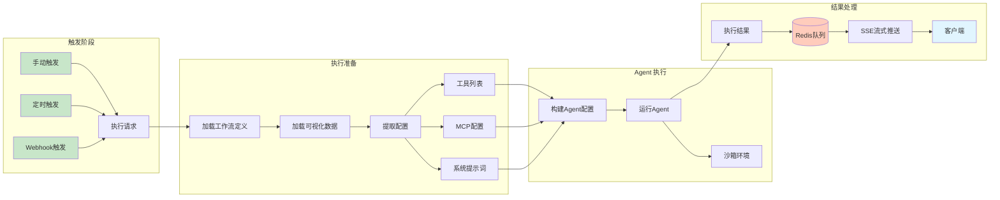
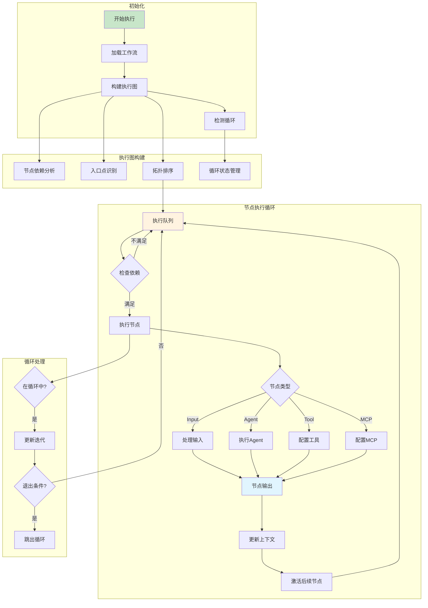
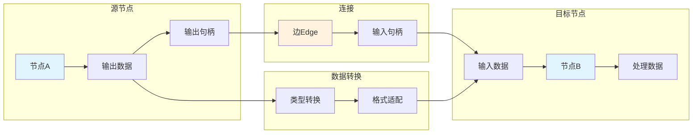
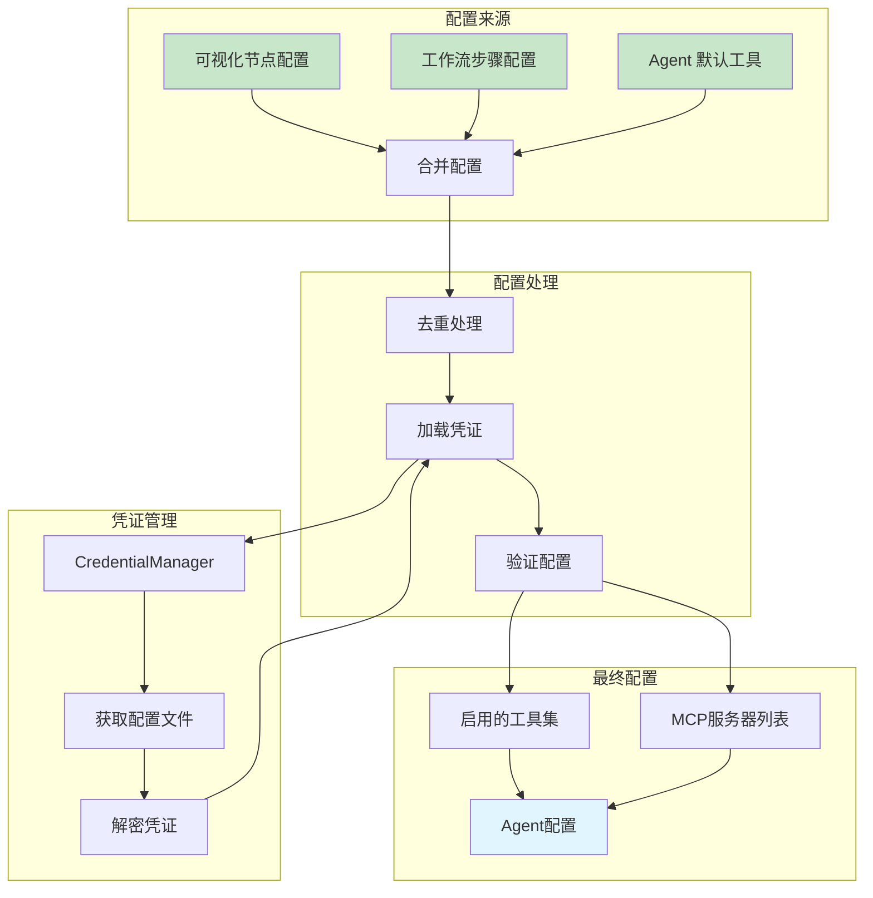
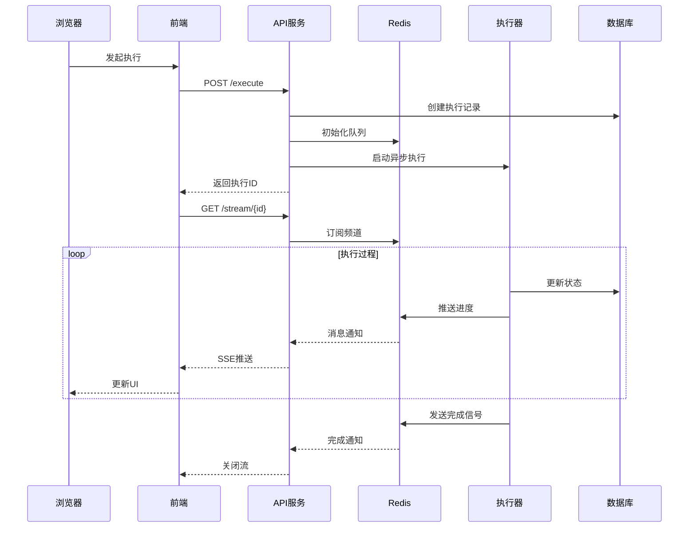
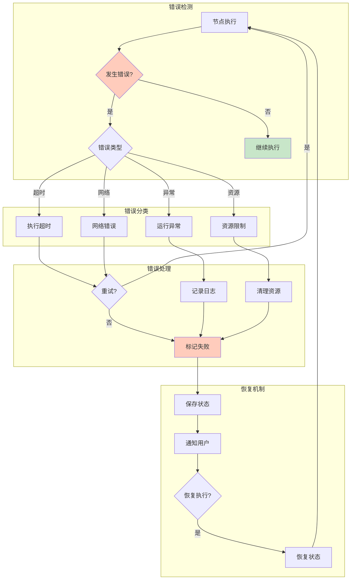
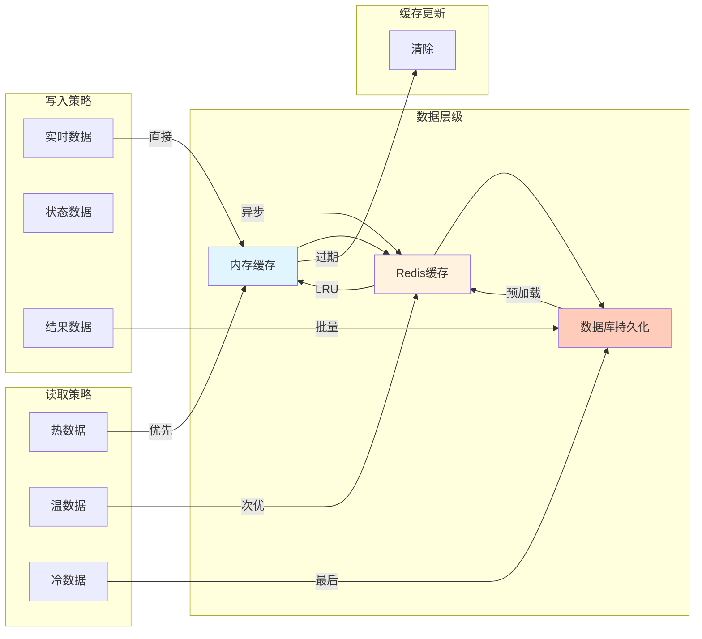

# Suna Workflow 数据流详细图解

## 1. 工作流创建数据流

## 2. 工作流执行数据流 - 传统模式

## 3. 工作流执行数据流 - 确定性模式

## 4. 节点间数据传递机制

## 5. 工具和 MCP 配置数据流

## 6. 实时状态同步数据流

## 7. 错误处理和恢复数据流

## 8. 数据持久化和缓存策略

## 总结

Suna Workflow 系统的数据流设计体现了以下特点：

1. **分层清晰**：前端展示层、业务逻辑层、数据存储层职责明确
2. **异步处理**：大量使用异步模式，提高系统响应性
3. **流式传输**：执行结果实时推送，用户体验良好
4. **容错机制**：完善的错误处理和恢复策略
5. **性能优化**：多级缓存和批量处理提升性能

这种设计确保了系统的高可用性、可扩展性和良好的用户体验。