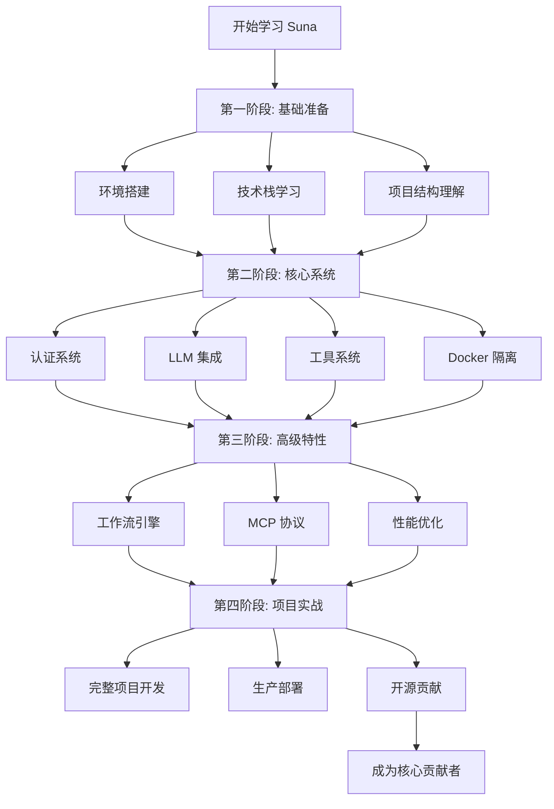
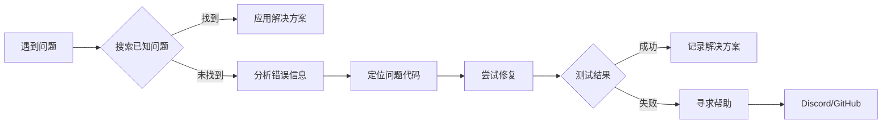

# Suna 项目学习路径图

## 🎯 学习路径可视化



## 📚 技能树

### 🌱 基础技能（必须掌握）

```
基础技能
├── Python 3.11+
│   ├── FastAPI 框架
│   ├── 异步编程
│   └── 类型注解
├── JavaScript/TypeScript
│   ├── React 18
│   ├── Next.js 15
│   └── React Hooks
├── 数据库
│   ├── PostgreSQL
│   ├── Supabase
│   └── Redis
└── 开发工具
    ├── Git
    ├── Docker
    └── VS Code
```

### 🌿 核心技能（深入理解）

```
核心技能
├── AI/LLM
│   ├── Prompt 工程
│   ├── LiteLLM 集成
│   ├── 上下文管理
│   └── 工具调用
├── 系统架构
│   ├── 微服务设计
│   ├── 事件驱动
│   ├── 消息队列
│   └── 缓存策略
├── 安全
│   ├── 认证授权
│   ├── 输入验证
│   ├── 沙箱隔离
│   └── 密钥管理
└── 前端架构
    ├── 状态管理
    ├── 服务端渲染
    ├── 实时通信
    └── 响应式设计
```

### 🌳 高级技能（专业方向）

```
高级技能
├── AI 工程
│   ├── 多模型协同
│   ├── RAG 系统
│   ├── Agent 设计
│   └── 评估指标
├── 平台工程
│   ├── K8s 部署
│   ├── 监控体系
│   ├── CI/CD
│   └── 负载均衡
├── 产品设计
│   ├── 用户研究
│   ├── 交互设计
│   ├── A/B 测试
│   └── 数据分析
└── 开源协作
    ├── 代码审查
    ├── 文档编写
    ├── 社区运营
    └── 版本发布
```

## 🎯 学习里程碑

### 第 2 周里程碑 ✅
- [ ] 本地环境运行成功
- [ ] 理解前后端通信流程
- [ ] 完成第一个代码修改
- [ ] 提交学习笔记

### 第 4 周里程碑 🚀
- [ ] 实现自定义 API 端点
- [ ] 理解 LLM 调用流程
- [ ] 创建简单的对话功能
- [ ] 优化一个现有功能

### 第 6 周里程碑 🛠️
- [ ] 开发完整的自定义工具
- [ ] 理解 Docker 安全机制
- [ ] 实现工具权限控制
- [ ] 编写工具文档

### 第 9 周里程碑 ⚡
- [ ] 完成性能优化方案
- [ ] 建立监控指标
- [ ] 实现缓存策略
- [ ] 处理并发场景

### 第 12 周里程碑 🎊
- [ ] 完成独立项目
- [ ] 成功部署到生产
- [ ] 提交开源 PR
- [ ] 获得社区认可

## 📈 评估标准

### 知识掌握度评估

| 阶段 | 初级 | 中级 | 高级 |
|------|------|------|------|
| 基础 | 能运行项目 | 能修改功能 | 能重构模块 |
| 核心 | 理解原理 | 独立开发 | 架构设计 |
| 高级 | 使用特性 | 优化性能 | 创新功能 |
| 实战 | 完成任务 | 解决问题 | 指导他人 |

### 实践能力矩阵

```
         简单  中等  复杂  专家
         
阅读代码  ✅    ✅    ✅    ✅
修改功能  ✅    ✅    ✅    ⬜
新增功能  ✅    ✅    ⬜    ⬜  
架构设计  ✅    ⬜    ⬜    ⬜
性能优化  ⬜    ⬜    ⬜    ⬜
```

## 🔧 实践项目建议

### 初级项目（1-2 周完成）
1. **自定义问候语**
   - 修改默认欢迎消息
   - 添加用户个性化
   - 实现时间问候

2. **简单统计面板**
   - 统计对话次数
   - 工具使用频率
   - 用户活跃度

### 中级项目（2-4 周完成）
1. **笔记管理工具**
   - 创建笔记
   - 搜索功能
   - 标签系统

2. **定时任务管理**
   - Cron 表达式
   - 任务队列
   - 执行日志

### 高级项目（4-6 周完成）
1. **知识库 RAG 系统**
   - 文档上传
   - 向量化存储
   - 智能检索

2. **多 Agent 协作**
   - Agent 通信
   - 任务分配
   - 结果聚合

## 🎓 学习资源推荐

### 视频教程
- [FastAPI 完整教程](https://www.youtube.com/fastapi)
- [Next.js 13+ 深入](https://www.youtube.com/nextjs)
- [LangChain 实战](https://www.youtube.com/langchain)

### 开源项目学习
- [AutoGPT](https://github.com/Significant-Gravitas/AutoGPT) - Agent 架构
- [LangChain](https://github.com/langchain-ai/langchain) - LLM 应用框架
- [n8n](https://github.com/n8n-io/n8n) - 工作流自动化

### 社区资源
- Suna Discord 服务器
- GitHub Discussions
- 技术博客和案例

## 💡 学习技巧

### 代码阅读方法
1. **入口追踪法**
   ```
   用户操作 → 前端组件 → API 调用 → 后端处理 → 数据库操作
   ```

2. **调试学习法**
   - 设置断点
   - 打印日志
   - 修改返回值
   - 观察变化

3. **重构理解法**
   - 提取函数
   - 重命名变量
   - 添加注释
   - 简化逻辑

### 问题解决流程


## 🏆 成就解锁

- 🥉 **铜章成就**
  - 首次运行项目
  - 第一个 PR 被合并
  - 帮助他人解决问题

- 🥈 **银章成就**
  - 开发完整功能
  - 优化性能 20%+
  - 编写技术文档

- 🥇 **金章成就**
  - 成为核心贡献者
  - 设计新架构
  - 指导新人成长

- 💎 **钻石成就**
  - 领导重大特性
  - 演讲分享经验
  - 推动项目发展

加油！相信通过系统学习，您一定能成为 Suna 项目的专家！🚀